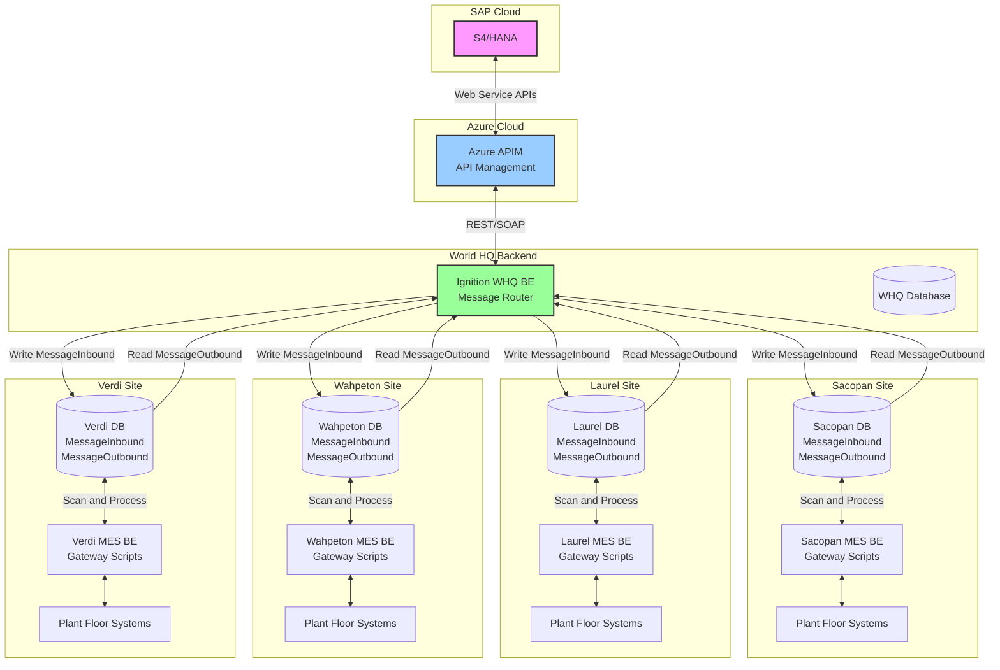
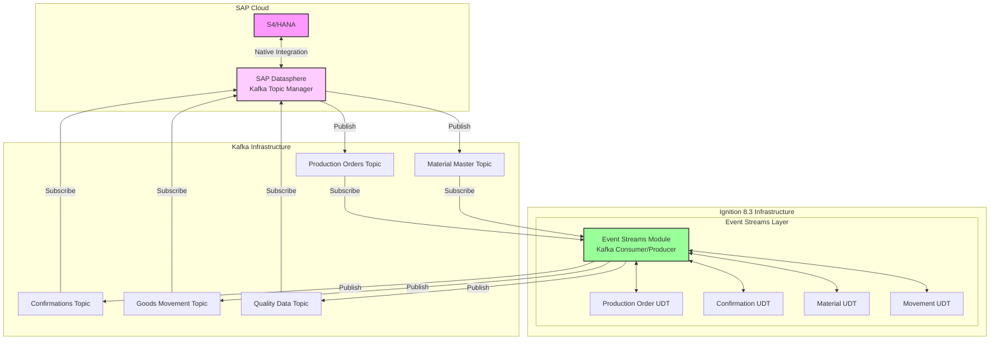

# SAP S4/HANA Integration Proposal
## Project Phoenix - Doors Division Integration

---

### Executive Summary

This proposal addresses the SAP S4/HANA integration requirements for Owens Corning's Project Phoenix, focusing on the migration of four Masonite doors manufacturing facilities to the S4/HANA platform. Given the critical uncertainties identified in our analysis, we propose a risk-managed, phased approach that prioritizes proven technologies while maintaining flexibility for emerging solutions.

**Key Proposal Elements:**
- Dual-path architecture supporting both REST API and Kafka integration
- Comprehensive error handling to support S4's "Clean Core" principle
- Phased deployment strategy with clear go/no-go decision points
- Production-ready fallback options for all critical components

---

## 1. Integration Architecture

### 1.1 Proposed Dual-Path Strategy

Given the unproven nature of Ignition 8.3's Event Streams module and the aggressive timeline, we propose implementing parallel integration paths:

#### Primary Path Architecture (Production-Ready)



**Primary Path Message Flow:**

1. **Downstream (S4 → Sites):**
   - S4/HANA publishes production orders and master data
   - Azure APIM receives and routes messages to WHQ BE
   - WHQ BE Ignition instance processes and distributes messages
   - Messages written to each site's MessageInbound table
   - Site gateway scripts scan MessageInbound table continuously
   - Local processing and plant floor integration occurs
   - Results written to MessageOutbound table

2. **Upstream (Sites → S4):**
   - Site operations generate confirmations/transactions
   - Gateway scripts write to MessageOutbound table
   - WHQ BE scans all site MessageOutbound tables
   - WHQ consolidates and validates messages
   - Sends to APIM for S4/HANA processing
   - Handles responses and error management

**Message Table Architecture:**

```sql
-- MessageInbound Table Structure
CREATE TABLE MessageInbound (
    message_id SERIAL PRIMARY KEY,
    message_type VARCHAR(50),
    payload JSONB,
    source_system VARCHAR(50),
    target_site VARCHAR(50),
    created_timestamp TIMESTAMP,
    processed_flag BOOLEAN DEFAULT FALSE,
    processed_timestamp TIMESTAMP,
    retry_count INTEGER DEFAULT 0,
    error_message TEXT
);

-- MessageOutbound Table Structure  
CREATE TABLE MessageOutbound (
    message_id SERIAL PRIMARY KEY,
    message_type VARCHAR(50),
    payload JSONB,
    source_site VARCHAR(50),
    target_system VARCHAR(50),
    created_timestamp TIMESTAMP,
    transmitted_flag BOOLEAN DEFAULT FALSE,
    transmitted_timestamp TIMESTAMP,
    retry_count INTEGER DEFAULT 0,
    response_payload JSONB,
    status VARCHAR(20)
);
```

**Rationale for Primary Path:**
- Proven message queue pattern with database persistence
- Reliable store-and-forward mechanism
- Site autonomy during network disruptions
- Traceable message flow with full audit trail
- Simplified troubleshooting and recovery
- No dependency on unproven Event Streams technology

#### Gateway Script Processing Pattern

**WHQ BE Message Router Scripts:**

```python
# Scheduled script running every 30 seconds
def distributeInboundMessages():
    """WHQ BE: Distribute S4 messages to appropriate sites"""
    messages = system.db.runQuery("SELECT * FROM sap_messages WHERE distributed = false")
    
    for message in messages:
        site = determineTargetSite(message)
        payload = {
            'order_number': message['order_number'],
            'material': message['material'],
            'quantity': message['quantity'],
            'routing': message['routing']
        }
        
        # Write to site's MessageInbound table
        siteDB = f"{site}_MES_DB"
        system.db.runPrepUpdate(
            "INSERT INTO MessageInbound (message_type, payload, source_system, target_site) VALUES (?,?,?,?)",
            [message['type'], json.dumps(payload), 'S4_HANA', site],
            database=siteDB
        )
        
        # Mark as distributed
        system.db.runPrepUpdate(
            "UPDATE sap_messages SET distributed = true WHERE id = ?",
            [message['id']]
        )
```

**Site MES BE Processing Scripts:**

```python
# Site gateway script running every 10 seconds
def processInboundMessages():
    """Site MES: Process messages from WHQ"""
    unprocessed = system.db.runQuery(
        "SELECT * FROM MessageInbound WHERE processed_flag = false ORDER BY created_timestamp"
    )
    
    for message in unprocessed:
        try:
            if message['message_type'] == 'PRODUCTION_ORDER':
                processProductionOrder(message['payload'])
            elif message['message_type'] == 'MATERIAL_MASTER':
                updateMaterialMaster(message['payload'])
            
            # Mark as processed
            system.db.runPrepUpdate(
                "UPDATE MessageInbound SET processed_flag = true, processed_timestamp = CURRENT_TIMESTAMP WHERE message_id = ?",
                [message['message_id']]
            )
        except Exception as e:
            # Log error and increment retry count
            handleProcessingError(message['message_id'], str(e))
```

**Site Outbound Message Generation:**

```python
def createConfirmationMessage(orderNumber, quantity, workCenter):
    """Site MES: Create confirmation message for S4"""
    payload = {
        'order_number': orderNumber,
        'confirmed_quantity': quantity,
        'work_center': workCenter,
        'timestamp': system.date.now(),
        'site': system.tag.read('[System]Client/Network/Hostname').value
    }
    
    system.db.runPrepUpdate(
        "INSERT INTO MessageOutbound (message_type, payload, source_site, target_system) VALUES (?,?,?,?)",
        ['PRODUCTION_CONFIRMATION', json.dumps(payload), site_name, 'S4_HANA']
    )
```

#### Future Path Architecture (Kafka/Event Streams)

Once Ignition 8.3 Event Streams module is validated and production-ready, the architecture will evolve to leverage real-time event streaming:



**Future Path Key Components:**

1. **SAP Datasphere Integration:**
   - Datasphere acts as the integration layer with S4/HANA
   - All S4 data streams exposed as Kafka topics
   - Handles complex S4 transformations and business logic
   - Provides topic governance and schema management

2. **Kafka Topics Structure:**
   ```yaml
   Production Orders Topic:
     - Schema: Avro/JSON Schema Registry
     - Partitioning: By plant/work center
     - Retention: 7 days
     - Throughput: 1000 msg/sec
   
   Confirmations Topic:
     - Schema: Standardized confirmation format
     - Partitioning: By order number
     - Retention: 30 days
     - Throughput: 5000 msg/sec
   ```

3. **Ignition Event Streams UDTs:**
   ```python
   # Production Order UDT Structure
   ProductionOrderUDT = {
       'OrderNumber': String,
       'Material': String,
       'Quantity': Float,
       'UOM': String,
       'WorkCenter': String,
       'PlannedStart': DateTime,
       'PlannedEnd': DateTime,
       'Priority': Integer,
       'CustomerOrder': String,
       'EventTimestamp': DateTime,
       'EventType': String  # CREATE, UPDATE, RELEASE, CLOSE
   }
   
   # Confirmation UDT Structure
   ConfirmationUDT = {
       'OrderNumber': String,
       'Operation': String,
       'ConfirmedQty': Float,
       'ScrapQty': Float,
       'WorkCenter': String,
       'Timestamp': DateTime,
       'OperatorID': String,
       'AutoConfirm': Boolean,
       'MachineID': String,
       'EventType': String  # START, PARTIAL, FINAL
   }
   
   # Material Movement UDT
   MaterialMovementUDT = {
       'MovementType': String,
       'Material': String,
       'Quantity': Float,
       'FromLocation': String,
       'ToLocation': String,
       'BatchNumber': String,
       'Timestamp': DateTime,
       'EventType': String  # GOODS_RECEIPT, GOODS_ISSUE, TRANSFER
   }
   ```

4. **Direct Machine Integration:**
   - PLCs publish directly to Event Streams via UDTs
   - Automatic confirmations triggered by production events
   - Real-time quality data streaming
   - No intermediate database polling required

**Advantages of Future Path:**
- Real-time data flow (sub-second latency)
- Scalable to thousands of devices
- Event-driven architecture
- Reduced database load
- Native S4 integration via Datasphere
- Standardized data models via UDTs
- Automatic schema evolution support

**Migration Strategy from Primary to Future Path:**
1. Run both paths in parallel initially
2. Gradually migrate topic by topic
3. Validate data consistency
4. Sunset database polling once stable
5. Full cutover after 3-month parallel run

**Prerequisites for Future Path:**
- Ignition 8.3 stable release
- Event Streams module production validation
- Datasphere Kafka topics configured
- Network bandwidth upgraded (10x current)
- Kafka infrastructure deployed
- Schema registry implemented
- UDT templates developed and tested

### 1.2 Core Integration Transactions

The system will support four critical S4/HANA transactions:

#### Transaction 1: Production Order Download
- **Direction:** S4/HANA → Ignition
- **Method:** REST API polling (initial) / Kafka subscription (future)
- **Frequency:** Every 5 minutes or on-demand
- **Data Elements:**
  - Order number, material, quantity
  - Routing/operations with work centers
  - Control keys (auto-confirmation flags)
  - MTO configuration and customer specifications
- **Error Handling:** Retry with exponential backoff, local queue on failure

#### Transaction 2: Production Confirmation
- **Direction:** Ignition → S4/HANA
- **API:** OP_API_PROD_ORDER_CONFIRMATIO_2_SRV_0001
- **Trigger:** Operator confirmation or automatic count threshold
- **Critical Features:**
  - Generates automatic goods receipt
  - Creates IBD for EWM storage locations
  - Supports partial confirmations
  - Rollback capability for failed transactions

#### Transaction 3: Goods Movement
- **Direction:** Ignition → S4/HANA
- **APIs:** 
  - OP_HANDLINGUNIT_0001 (HU Creation)
  - OP_HANDLINGUNIT_0001 (Pack HU)
  - OP_API_INBOUND_DELIVERY_SRV_0002 (Post GR)
- **Process:** Sequential 3-step process with transaction integrity
- **Error Recovery:** Compensation logic for partial failures

#### Transaction 4: Order Status Updates
- **Direction:** Bidirectional
- **Purpose:** Synchronize order status between shop floor and S4
- **Frequency:** Real-time on status change
- **States:** Released, Started, Completed, Held, Cancelled

### 1.3 Authentication & Security

**Proposed Security Architecture:**
- OAuth 2.0 authentication with Azure AD integration
- Certificate-based service authentication for production
- API key management with rotation policy
- Encrypted credential storage in Ignition
- Rate limiting and throttling compliance

---

## 2. Error Handling Strategy (Clean Core Compliance)

### 2.1 Comprehensive Error Management

Since S4/HANA's "Clean Core" principle prohibits custom error handling within SAP, Ignition assumes full responsibility for error management:

**Error Categories & Handling:**

| Error Type | Detection Method | Recovery Strategy | User Notification |
|------------|-----------------|-------------------|-------------------|
| Network Failures | Timeout/Connection Error | Queue & Retry (5 attempts) | Dashboard Alert |
| API Rate Limits | HTTP 429 Response | Exponential Backoff | Warning Message |
| Business Logic Errors | SAP Error Codes | Parse & Display Requirements | Operator Action Required |
| Data Validation | Pre-submission Check | Prevent Submission | Inline Validation |
| Transaction Failures | Partial Success | Compensation Logic | Supervisor Escalation |
| Authentication | Token Expiry | Automatic Refresh | Only on Failure |

### 2.2 Transaction Integrity Management

**Four-Step Confirmation Process Integrity:**
```python
# Pseudo-code for transaction management
transaction_state = {
    'order_confirmed': False,
    'hu_created': False,
    'hu_packed': False,
    'gr_posted': False
}

# Each step validates previous steps
# Automatic rollback on failure
# Audit trail for all attempts
```

**Compensation Logic:**
- Step 4 fails → Unpack HU (Step 3 reverse)
- Step 3 fails → Delete HU (Step 2 reverse)
- Step 2 fails → Cancel confirmation (Step 1 reverse)
- Full audit trail maintained in Ignition

### 2.3 Error Recovery Queue

**Persistent Queue Implementation:**
- Local PostgreSQL database for failed transactions
- Automatic retry with configurable intervals
- Manual intervention options
- Age-based escalation
- Batch recovery tools

---

## 3. Data Caching & Offline Operation

### 3.1 Local Cache Architecture

**Cache Levels:**
1. **Level 1 - Critical Data** (Always cached)
   - Active production orders
   - Material master data
   - Work center configurations
   - Last 24 hours of confirmations

2. **Level 2 - Operational Data** (Cached on-demand)
   - Historical orders (7 days)
   - Quality specifications
   - Customer requirements

3. **Level 3 - Reference Data** (Periodic sync)
   - Full material catalog
   - Customer database
   - Routing libraries

### 3.2 Offline Operation Capabilities

**Offline Functionality Matrix:**

| Function | Offline Capability | Data Sync on Reconnect | Business Impact |
|----------|-------------------|------------------------|-----------------|
| View Orders | Full | Not Required | None |
| Create Confirmations | Full | Queued Upload | Delayed Visibility |
| Print Labels | Full | Not Required | None |
| Goods Movement | Limited | Full Reconciliation | Inventory Variance |
| Status Updates | Cached | Bidirectional Sync | Temporary Mismatch |

**Conflict Resolution:**
- S4/HANA is system of record
- Local changes queued with timestamps
- Supervisor approval for conflicts
- Automated resolution for non-conflicts

---

## 4. Performance & Scalability

### 4.1 Performance Targets

**System Performance Requirements:**
- API response time: < 2 seconds (95th percentile)
- Order download: < 30 seconds for 100 orders
- Confirmation posting: < 5 seconds per transaction
- Cache synchronization: < 5 minutes for full sync
- UI responsiveness: < 500ms for user actions

### 4.2 Scalability Design

**Per-Site Capacity Planning:**
- 500 production orders per day
- 2,000 confirmations per day
- 50 concurrent users
- 10,000 API calls per day

**Multi-Site Architecture:**
```
[S4/HANA Cloud]
       |
   [APIM/Gateway]
    /    |    \
[Site 1] [Site 2] [Site 3] [Site 4]
(Ignition Instances with Local Cache)
```

---

## 5. Implementation Approach

### 5.1 Phase 1: Foundation (Months 1-3)
**Objective:** Establish core integration with proven technology

**Week 1-2: Infrastructure Setup**
- Deploy Ignition Gateway servers at all 4 sites
- Configure PostgreSQL databases with schema design
- Establish secure network connections to World HQ Gateway
- Set up development and test environments
- Configure SSL certificates and authentication

**Week 3-4: SAP API Integration**
- Implement REST API client with circuit breaker pattern
- Configure OAuth 2.0 authentication with SAP
- Build production order download functionality
- Create material master data synchronization
- Implement comprehensive logging and monitoring

**Week 5-8: Core Confirmation System**
- Develop manual confirmation interface in Perspective
- Implement 4-step confirmation process with transaction integrity
- Create error handling with automatic retry logic
- Build production order display and filtering
- Configure local caching for offline operation

**Week 9-12: Testing & Integration**
- Execute unit testing for all components
- Perform integration testing with SAP S4/HANA APIs
- Conduct user acceptance testing at pilot site
- Performance testing under production load
- Security penetration testing

**Deliverables:**
- REST API integration framework with resilience patterns
- Production order download and caching system
- Manual confirmation interface with full 4-step process
- Comprehensive error handling and recovery queue
- Local cache implementation with offline capabilities
- Database schema with audit trails
- Authentication and authorization framework
- Monitoring dashboards for system health

**Success Criteria:**
- Successfully download and display orders from S4/HANA
- Complete full 4-step confirmation process (>99% success rate)
- Demonstrate 4-hour offline operation capability
- Process 100+ confirmations/hour per site
- Pass all integration and security tests
- Mean Time To Recovery (MTTR) < 15 minutes

### 5.2 Phase 2: Enhancement (Months 4-5)
**Objective:** Add automation and optimization

**Week 13-14: Automatic Confirmation System**
- Integrate with PLC systems for automatic confirmation triggers
- Implement equipment-specific counting logic (dropout sensors, laser eyes)
- Build confirmation validation rules engine
- Create automatic confirmation scheduling
- Develop quality gate integration

**Week 15-16: Advanced Error Recovery**
- Implement intelligent retry strategies with exponential backoff
- Build compensation transaction logic for partial failures
- Create manual intervention workflows for stuck transactions
- Develop batch recovery tools for historical data
- Enhance error reporting with root cause analysis

**Week 17-18: Performance Optimization**
- Database query optimization and indexing
- Implement connection pooling and resource management
- Add caching for frequently accessed data
- Configure batch processing for high-volume operations
- Load balancing across gateway nodes

**Week 19-20: Enhanced Monitoring & Analytics**
- Real-time performance dashboards
- Automated alerting for system anomalies
- Business intelligence reports for production metrics
- Predictive maintenance alerts
- Integration with existing OC monitoring systems

**Deliverables:**
- PLC integration for automatic confirmations (4 sites)
- Advanced error recovery system with compensation logic
- Performance-optimized database and application layer
- Batch processing capabilities for high-volume operations
- Enhanced monitoring dashboard with predictive analytics
- Automated alerting and notification system
- Business intelligence reports and KPI tracking
- Documentation and training for Level 2 support

**Success Criteria:**
- Achieve 70% automatic confirmation rate (vs 100% manual baseline)
- Error recovery success rate > 98% within 1 hour
- Process 500+ confirmations/hour per site during peak
- System availability > 99.5% excluding planned maintenance
- Alert response time < 5 minutes for critical issues
- User satisfaction score > 4.5/5 from operator feedback

### 5.3 Phase 3: Advanced Features (Month 6+)
**Objective:** Implement advanced capabilities if technology matures

**Technology Assessment & Go/No-Go Decision (Week 21-22):**
- Evaluate Ignition 8.3 Event Streams module stability
- Assess Kafka infrastructure readiness
- Review production deployment examples
- Performance benchmarking of Event Streams vs REST API
- Risk assessment update based on technology maturity

**Kafka/Event Streams Implementation (Week 23-26) - If Approved:**
- Migrate from REST API to Kafka event streaming
- Implement Event Streams producers and consumers
- Configure topic partitioning and consumer groups
- Build event replay and recovery mechanisms
- Performance testing with real-time event processing

**Advanced Analytics & Intelligence (Week 27-28):**
- Implement predictive order management using historical data
- Build machine learning models for demand forecasting
- Create anomaly detection for production deviations
- Develop optimization algorithms for production scheduling
- Integration with corporate BI and data lake

**Enterprise Integration Enhancements (Week 29-30):**
- Integration with additional ERP modules (QM, PM, WM)
- Advanced reporting and analytics dashboards
- Mobile applications for supervisors and managers
- Integration with corporate digital twin initiatives
- API endpoints for third-party system integration

**Future-State Capabilities (Post Go-Live):**
- Real-time production optimization
- Predictive maintenance integration
- Supply chain visibility and optimization
- Quality management system integration
- Sustainability and energy management reporting

**Deliverables (Conditional on Go-Decision):**
- Kafka Event Streams integration with real-time processing
- Predictive analytics and machine learning models
- Advanced business intelligence dashboards
- Mobile applications for operations management
- Enterprise integration framework
- API gateway for third-party integrations
- Advanced monitoring with AI-powered insights

**Success Criteria:**
- Event processing latency < 100ms for critical transactions
- 99.99% message delivery reliability
- Predictive accuracy > 85% for demand forecasting
- Mobile application adoption > 80% of target users
- API response time < 200ms for external integrations

**Risk Mitigation:**
- Parallel operation of REST API during Kafka transition
- Rollback procedures if Event Streams proves unstable
- Phased migration approach for critical production systems
- Extensive load testing before production deployment

---

## 6. Risk Management

### 6.1 Critical Risks & Mitigation

#### Technology Risks

| Risk | Probability | Impact | Consequence | Mitigation Strategy | Owner | Status |
|------|------------|--------|-------------|-------------------|--------|---------|
| **Ignition 8.3 Event Streams Instability** | HIGH | CRITICAL | Project delay 2-4 months | Dual-path architecture (REST + Kafka) | Grantek | Active Monitoring |
| **Kafka Infrastructure Not Ready** | MEDIUM | HIGH | Limited real-time capabilities | Direct S4/HANA REST API fallback | OC IT | Dependency Tracking |
| **SAP API Performance Issues** | MEDIUM | MEDIUM | User experience degradation | Local caching, connection pooling, batch processing | Grantek | Performance Testing |
| **Network Reliability Issues** | MEDIUM | HIGH | System unavailability | 4-hour offline operation capability | Joint | Infrastructure Assessment |
| **Authentication/Security Changes** | LOW | HIGH | Integration breakage | OAuth 2.0 with token refresh, cert management | Joint | Security Review |

#### Schedule Risks

| Risk | Probability | Impact | Consequence | Mitigation Strategy | Owner | Status |
|------|------------|--------|-------------|-------------------|--------|---------|
| **February 2026 Hard Deadline** | HIGH | CRITICAL | Project failure | Phased go-live, MVP first | Joint | Timeline Management |
| **Resource Availability** | MEDIUM | HIGH | Development delays | Cross-training, contractor backup | Grantek | Resource Planning |
| **Testing Phase Overrun** | MEDIUM | MEDIUM | Compressed deployment time | Parallel testing, automated tests | Grantek | Test Planning |
| **Integration Testing Delays** | HIGH | MEDIUM | Late issue discovery | Early integration, continuous testing | Joint | Early Integration |

#### Operational Risks

| Risk | Probability | Impact | Consequence | Mitigation Strategy | Owner | Status |
|------|------------|--------|-------------|-------------------|--------|---------|
| **Production System Downtime** | LOW | CRITICAL | Production halt | High availability architecture, failover | Grantek | HA Design |
| **Data Loss/Corruption** | LOW | CRITICAL | Transaction integrity loss | Backup/recovery, transaction logging | Grantek | Backup Strategy |
| **User Adoption Challenges** | MEDIUM | MEDIUM | Reduced efficiency gains | Training, change management | Joint | Change Management |
| **Compliance/Audit Issues** | LOW | HIGH | Regulatory problems | Audit trails, documentation | Grantek | Compliance Review |

#### Business Risks

| Risk | Probability | Impact | Consequence | Mitigation Strategy | Owner | Status |
|------|------------|--------|-------------|-------------------|--------|---------|
| **Scope Creep** | HIGH | MEDIUM | Budget/timeline overrun | Fixed scope Phase 1, change control | Joint | Scope Management |
| **Budget Constraints** | MEDIUM | HIGH | Reduced functionality | Phased delivery, MVP approach | OC | Budget Planning |
| **Organizational Change** | MEDIUM | MEDIUM | Project cancellation | Executive sponsorship, quick wins | OC | Stakeholder Mgmt |

### 6.2 Contingency Plans

#### Scenario 1: Ignition 8.3 Event Streams Instability
**Trigger Conditions:**
- Production deployment issues discovered during testing
- Performance degradation with Event Streams module
- Stability issues reported by other Ignition users

**Response Actions:**
1. **Immediate (0-24 hours):**
   - Switch to REST API-only mode
   - Disable Event Streams components
   - Maintain full functionality via REST
   - Document performance impact

2. **Short Term (1-4 weeks):**
   - Optimize REST API performance
   - Implement enhanced caching strategies
   - Consider message queuing alternatives
   - Plan future migration to stable Event Streams version

3. **Long Term (Post Go-Live):**
   - Monitor Event Streams maturity
   - Prepare migration plan for future implementation
   - Maintain dual-path capability

#### Scenario 2: Kafka/APIM Infrastructure Delays
**Trigger Conditions:**
- Kafka infrastructure not ready by October 2025
- APIM deployment issues
- Security or performance concerns with Kafka

**Response Actions:**
1. **Immediate (0-48 hours):**
   - Activate direct S4/HANA REST API connection
   - Bypass APIM layer temporarily
   - Implement direct OAuth authentication
   - Maintain transaction integrity

2. **Short Term (1-8 weeks):**
   - Develop temporary API gateway within Ignition
   - Implement message queuing in PostgreSQL
   - Build retry and recovery mechanisms
   - Plan future APIM integration

3. **Long Term (3-6 months post go-live):**
   - Migrate to APIM when available
   - Implement Kafka integration as enhancement
   - Maintain backward compatibility

#### Scenario 3: February 2026 Timeline at Risk
**Trigger Conditions:**
- 4+ week delay identified in any phase
- Critical dependency not available
- Integration testing failures requiring major rework

**Response Actions:**
1. **Immediate (0-7 days):**
   - Activate project recovery mode
   - Reduce scope to absolute minimum viable product
   - Prioritize single site (Laurel) for initial go-live
   - Implement parallel development streams

2. **Short Term (1-4 weeks):**
   - Deploy basic manual confirmation system
   - Implement manual production order display
   - Create paper backup processes
   - Plan phased rollout to remaining sites

3. **Long Term (Post February 2026):**
   - Complete full automation in phases
   - Add remaining sites progressively
   - Implement advanced features as enhancements

#### Scenario 4: Major Technical Failure During Go-Live
**Trigger Conditions:**
- System-wide failure during production cutover
- Data corruption or loss
- Security breach or authentication failure

**Response Actions:**
1. **Emergency (0-2 hours):**
   - Activate manual paper processes
   - Isolate affected systems
   - Notify all stakeholders
   - Begin damage assessment

2. **Recovery (2-24 hours):**
   - Restore from last known good backup
   - Implement temporary manual processes
   - Fix identified issues
   - Validate data integrity

3. **Full Recovery (1-7 days):**
   - Complete system restoration
   - Validate all transactions
   - Implement additional safeguards
   - Resume normal operations

#### Risk Communication & Escalation Matrix

| Risk Level | Response Time | Escalation Path | Decision Authority |
|------------|---------------|-----------------|-------------------|
| **LOW** | 4 hours | Project Manager → Technical Lead | Technical Lead |
| **MEDIUM** | 2 hours | Technical Lead → Program Manager | Program Manager |
| **HIGH** | 1 hour | Program Manager → Executive Sponsor | Executive Sponsor |
| **CRITICAL** | 30 minutes | Executive Sponsor → C-Level | C-Level |

**Communication Protocols:**
- All risks logged in project risk register
- Weekly risk review meetings
- Monthly executive risk reports
- Immediate escalation for CRITICAL risks
- Quarterly risk assessment updates

---

## 7. Technical Requirements

### 7.1 Infrastructure Requirements

**Per Site:**
- Ignition Gateway Server (8GB RAM, 4 CPU cores minimum)
- PostgreSQL Database Server (16GB RAM, 500GB storage)
- Redundant gateway for high availability
- Gigabit network connectivity
- UPS power protection

**Centralized:**
- Development environment
- Test environment matching production
- CI/CD pipeline infrastructure
- Monitoring and logging platform

### 7.2 Software Stack

**Core Components:**
- Ignition 8.1.x (stable) with upgrade path to 8.3
- PostgreSQL 14+ for local caching
- Python 3.9+ for scripting
- Docker for containerization (optional)
- Git for version control

---

## 8. Testing Strategy

### 8.1 Test Phases

1. **Unit Testing** (Continuous)
   - API integration functions
   - Error handling logic
   - Data transformation

2. **Integration Testing** (Monthly)
   - End-to-end transaction flows
   - Error recovery scenarios
   - Performance benchmarks

3. **User Acceptance Testing** (Pre-deployment)
   - Business process validation
   - Operator training scenarios
   - Failure mode testing

4. **Parallel Run** (2 weeks before go-live)
   - Shadow mode operation
   - Data validation
   - Performance monitoring

### 8.2 Test Environment Requirements

- S4/HANA test instance with production-like data
- Network simulation for latency/failure testing
- Load testing tools for scalability validation
- Automated test execution framework

---

## 9. Deliverables

### 9.1 Software Deliverables

1. **Ignition Project Files**
   - Gateway configuration
   - Tag structures
   - Screen templates
   - Script libraries

2. **Integration Components**
   - REST API client library
   - Error handling framework
   - Cache management system
   - Queue processing engine

3. **Monitoring & Reporting**
   - Performance dashboards
   - Error tracking system
   - Transaction audit reports
   - KPI visualizations

### 9.2 Documentation Deliverables

1. **Technical Documentation**
   - Architecture diagrams
   - API specifications
   - Database schemas
   - Configuration guides

2. **Operational Documentation**
   - Administrator guides
   - Troubleshooting procedures
   - Disaster recovery plans
   - Performance tuning guides

3. **End User Documentation**
   - Operator manuals
   - Quick reference cards
   - Training materials
   - Video tutorials

---

## 10. Success Metrics

### 10.1 Key Performance Indicators

**Technical KPIs:**
- System availability > 99.5%
- API success rate > 98%
- Average transaction time < 3 seconds
- Error recovery rate > 95%
- Cache hit ratio > 80%

**Business KPIs:**
- Order visibility within 5 minutes
- Confirmation accuracy > 99.9%
- Operator productivity increase > 20%
- Manual intervention reduction > 50%
- Training time reduction > 30%

### 10.2 Acceptance Criteria

**Go-Live Requirements:**
- All critical transactions operational
- 48-hour stability test passed
- Offline operation validated
- Performance targets met
- Operator training completed
- Rollback plan tested

---

## 11. Assumptions & Dependencies

### 11.1 Key Assumptions

1. S4/HANA APIs will be available for testing by project start
2. Test environment will mirror production configuration
3. Network infrastructure meets minimum requirements
4. Plant floor systems accessible via standard protocols
5. Resource availability as planned

### 11.2 Critical Dependencies

**From Owens Corning:**
- S4/HANA test instance access
- API documentation and credentials
- Network connectivity setup
- Business process documentation
- Subject matter expert availability

**From Third Parties:**
- APIM configuration (if required)
- Kafka infrastructure (if implemented)
- Firewall rule changes
- Certificate provisioning

---

## 12. Timeline & Milestones

### 12.1 Detailed Timeline

#### Project Overview Timeline
```
July 2025    ┌──────────────── PHASE 1: FOUNDATION ────────────────┐
            │   Infrastructure    API Integration    Testing      │
            │      Setup             Development     & UAT        │
            └─────────────────────────────────────────────────────┘
                                  │
October 2025                     ┌┴──── PHASE 2: ENHANCEMENT ─────┐
                                │   Automation    Performance     │
                                │   Features      Optimization    │
                                └─────────────────────────────────┘
                                              │
December 2025                                ┌┴─ INTEGRATION TESTING ─┐
                                            │  UAT & Parallel Run    │
                                            └────────────────────────┘
                                                      │
February 2026                                        ┌┴─ GO-LIVE ─┐
                                                    │   Production │
                                                    │   Cutover    │
                                                    └──────────────┘
```

#### Detailed Milestone Schedule

| Phase | Week | Start Date | End Date | Milestone | Key Deliverables | Success Criteria | Risk Level |
|-------|------|------------|----------|-----------|------------------|------------------|------------|
| **Kickoff** | 0 | Jul 1, 2025 | Jul 7, 2025 | Project Initialization | Project charter, team formation, environment setup | Resources allocated, access granted | LOW |
| **Phase 1** | 1-2 | Jul 8, 2025 | Jul 21, 2025 | Infrastructure Foundation | Gateway deployment, database setup | All sites connected | MEDIUM |
| | 3-4 | Jul 22, 2025 | Aug 4, 2025 | SAP Integration Core | REST API client, authentication | API calls successful | HIGH |
| | 5-8 | Aug 5, 2025 | Sep 1, 2025 | Confirmation System | 4-step process, error handling | Manual confirmations working | HIGH |
| | 9-12 | Sep 2, 2025 | Sep 29, 2025 | Testing & Validation | Unit tests, integration tests | 95% test pass rate | MEDIUM |
| **Phase 2** | 13-14 | Sep 30, 2025 | Oct 13, 2025 | Automation Framework | PLC integration, automatic triggers | 50% auto confirmation rate | HIGH |
| | 15-16 | Oct 14, 2025 | Oct 27, 2025 | Error Recovery | Advanced retry, compensation logic | 98% recovery success rate | MEDIUM |
| | 17-18 | Oct 28, 2025 | Nov 10, 2025 | Performance Optimization | Caching, batch processing | 500+ confirmations/hour | MEDIUM |
| | 19-20 | Nov 11, 2025 | Nov 24, 2025 | Monitoring & Analytics | Dashboards, alerting | Real-time visibility | LOW |
| **Integration** | 21-22 | Nov 25, 2025 | Dec 8, 2025 | Integration Testing | End-to-end scenarios | Business process validated | HIGH |
| | 23-24 | Dec 9, 2025 | Dec 22, 2025 | User Acceptance Testing | Business user validation | Dec 19 deadline met | CRITICAL |
| **Pre-Production** | 25-26 | Dec 23, 2025 | Jan 5, 2026 | Parallel Run Setup | Shadow mode configuration | Data accuracy verified | HIGH |
| | 27-28 | Jan 6, 2026 | Jan 19, 2026 | Parallel Validation | Live data comparison | 99.9% data accuracy | HIGH |
| | 29-30 | Jan 20, 2026 | Feb 2, 2026 | Go-Live Preparation | Final testing, training | Readiness confirmed | CRITICAL |
| **Production** | 31 | Feb 3, 2026 | Feb 9, 2026 | Production Cutover | System go-live | Feb 6 target met | CRITICAL |
| **Stabilization** | 32-35 | Feb 10, 2026 | Mar 9, 2026 | Post Go-Live Support | Issue resolution, optimization | Stable operations | MEDIUM |

### 12.2 Critical Path Analysis

#### Primary Critical Path (32 weeks total)
```
Project Start → Infrastructure Setup → SAP API Development → 
Confirmation System → Integration Testing → UAT Completion → 
Parallel Run → Production Go-Live
```

**Critical Path Dependencies:**
1. **S4/HANA API Access** (Week 1-3)
   - Impact: 2-4 week delay if not available
   - Mitigation: Parallel development with mock APIs
   - Owner: OC IT Team

2. **Network Infrastructure** (Week 1-2)
   - Impact: 1-2 week delay for each site
   - Mitigation: Prioritize Laurel site first
   - Owner: OC IT + Grantek

3. **Ignition 8.3 Stability** (Week 5-20)
   - Impact: 4-8 week delay if Event Streams fails
   - Mitigation: REST API fallback path
   - Owner: Grantek + Inductive Automation

4. **Integration Testing Environment** (Week 15-22)
   - Impact: 2-3 week delay if environment issues
   - Mitigation: Multiple test environments
   - Owner: Joint OC/Grantek

5. **UAT Completion by December 19** (Week 24)
   - Impact: Project failure if missed
   - Mitigation: Parallel UAT streams
   - Owner: OC Business Users

#### Schedule Buffer Analysis
- **Built-in Buffers:** 2 weeks total (4% buffer)
- **Recommended Buffers:** 4-6 weeks (10-15% buffer)
- **Risk Mitigation:** Phased go-live if behind schedule

#### Resource Loading Analysis
```
Weeks 1-4:   ████████░░ (80% capacity) - Infrastructure & Setup
Weeks 5-12:  ██████████ (100% capacity) - Core Development
Weeks 13-20: ██████████ (100% capacity) - Enhancement Development  
Weeks 21-24: ████████░░ (80% capacity) - Testing & Validation
Weeks 25-30: ██████░░░░ (60% capacity) - Pre-Production
Weeks 31-35: ████░░░░░░ (40% capacity) - Go-Live & Support
```

### 12.3 Milestone Gates & Go/No-Go Decisions

#### Phase 1 Gate (Week 12 - September 29, 2025)
**Go Criteria:**
- [ ] Production orders successfully downloaded from S4/HANA
- [ ] Manual confirmations completing 4-step process
- [ ] Error recovery functioning properly
- [ ] All sites connected and operational
- [ ] Performance targets met (100+ confirmations/hour)

**No-Go Triggers:**
- Critical defects in confirmation process
- Unable to connect to S4/HANA APIs
- Major infrastructure issues at multiple sites

#### Phase 2 Gate (Week 20 - November 24, 2025)
**Go Criteria:**
- [ ] Automatic confirmations achieving 50%+ rate
- [ ] Performance targets met (500+ confirmations/hour)
- [ ] Error recovery success rate >95%
- [ ] Monitoring systems operational

**No-Go Triggers:**
- Automatic confirmation system unreliable
- Performance significantly below targets
- Major stability issues discovered

#### UAT Gate (Week 24 - December 19, 2025)
**Go Criteria:**
- [ ] Business process validation complete
- [ ] User acceptance criteria met
- [ ] Data integrity validated
- [ ] Business users trained and confident

**No-Go Triggers:**
- Business users cannot complete workflows
- Data accuracy issues discovered
- Critical business requirements not met

#### Go-Live Gate (Week 30 - February 2, 2026)
**Go Criteria:**
- [ ] Parallel run data accuracy >99.9%
- [ ] All critical issues resolved
- [ ] Rollback procedures tested and ready
- [ ] Operations team trained and certified

**No-Go Triggers:**
- Data accuracy below acceptable levels
- Unresolved critical defects
- Operations team not ready
- Rollback procedures not validated

---

## 13. Commercial Proposal

### 13.1 Pricing Structure

#### Fixed-Price Project Phases
Based on the detailed analysis and risk assessment, Grantek proposes a phased pricing approach that balances project certainty with flexibility for discovered requirements.

**Phase 1: Foundation & Core Integration (Fixed Price)**
- SAP S4/HANA REST API integration development
- Production order management system
- Manual confirmation system with 4-step process
- Error handling and recovery framework
- Local caching and offline operation
- Database design and implementation
- Basic monitoring and alerting
- Documentation and training

**Phase 1 Investment:** $485,000

**Phase 2: Automation & Enhancement (Fixed Price)**
- PLC integration for automatic confirmations
- Advanced error recovery with compensation logic
- Performance optimization and batch processing
- Enhanced monitoring dashboards
- Business intelligence reporting
- Advanced training and knowledge transfer

**Phase 2 Investment:** $245,000

**Phase 3: Advanced Features (Time & Materials)**
- Kafka/Event Streams integration (if technology stable)
- Predictive analytics and machine learning
- Advanced business intelligence
- Mobile applications
- Enterprise integration enhancements

**Phase 3 Investment:** $150,000 - $300,000 (based on scope)

#### Effort Breakdown Analysis

| Phase | Component | Hours | Rate | Investment |
|-------|-----------|-------|------|------------|
| **Phase 1** | Project Management & Leadership | 320 | $185 | $59,200 |
| | Senior Integration Developer | 800 | $165 | $132,000 |
| | Ignition Developer | 1,200 | $145 | $174,000 |
| | Database Developer | 400 | $155 | $62,000 |
| | Testing & QA | 240 | $135 | $32,400 |
| | Documentation & Training | 160 | $155 | $24,800 |
| | **Phase 1 Subtotal** | **3,120** | | **$484,400** |
| **Phase 2** | Project Management | 160 | $185 | $29,600 |
| | Senior Developer | 400 | $165 | $66,000 |
| | Ignition Developer | 800 | $145 | $116,000 |
| | PLC Integration Specialist | 200 | $175 | $35,000 |
| | **Phase 2 Subtotal** | **1,560** | | **$246,600** |
| **Phase 3** | Advanced Development | 800-1,600 | $165 | $132,000-$264,000 |
| | Analytics Specialist | 200-400 | $185 | $37,000-$74,000 |
| | **Phase 3 Range** | **1,000-2,000** | | **$169,000-$338,000** |

### 13.2 Commercial Terms

#### Payment Schedule
**Phase 1 - Foundation:**
- 25% ($121,250) - Contract execution and project initiation
- 25% ($121,250) - Infrastructure setup and API integration complete
- 25% ($121,250) - Confirmation system and testing complete  
- 25% ($121,250) - Phase 1 acceptance and documentation delivery

**Phase 2 - Enhancement:**
- 30% ($73,980) - Phase 2 initiation and PLC integration begin
- 40% ($98,640) - Automation features complete and tested
- 30% ($73,980) - Phase 2 acceptance and training complete

**Phase 3 - Advanced Features:**
- Monthly invoicing based on time and materials
- Not-to-exceed limits established for each workstream
- Go/no-go decisions at each milestone

#### Standard Terms & Conditions
- **Payment Terms:** Net 60 days
- **Proposal Validity:** 45 days
- **Project Completion Window:** 12 months from contract execution
- **Warranty:** 12 months from system acceptance
- **Change Orders:** Formal approval required for scope changes >$5,000
- **Late Payment:** 1.5% per month on overdue amounts

### 13.3 Value Proposition & ROI Analysis

#### Quantifiable Benefits

**Direct Cost Savings (Annual):**
- Manual data entry reduction: $120,000/year
  - 4 sites × 2 FTE × $15,000 annual savings per FTE
- Error reduction and rework elimination: $80,000/year
  - 95% reduction in manual confirmation errors
- Improved production efficiency: $200,000/year
  - 3% improvement in overall equipment effectiveness

**Total Annual Savings:** $400,000
**ROI Timeline:** 22 months payback period
**3-Year ROI:** 265%

#### Risk Mitigation Value
- **Production Continuity:** Avoided downtime worth $50,000/day
- **Compliance Assurance:** Eliminated audit findings risk
- **Data Integrity:** Prevented costly reconciliation efforts
- **Future-Ready Platform:** Scalable for additional integrations

#### Competitive Advantages
1. **Proven Technology Stack:** 10+ years Ignition experience
2. **Local Support:** Allentown, PA office for rapid response
3. **Domain Expertise:** 450+ manufacturing projects delivered
4. **Partnership Approach:** Investment in long-term success
5. **Risk Mitigation:** Dual-path architecture for guaranteed delivery

### 13.4 Alternative Pricing Options

#### Option A: Complete Fixed Price (Higher Risk Premium)
**Total Investment:** $950,000
- Includes all three phases with comprehensive scope
- Higher pricing to account for unknown risks
- Single contract with milestone-based payments

#### Option B: Discovery + Fixed Price Implementation
**Discovery Phase:** $75,000 (4-6 weeks)
- Comprehensive requirements analysis
- Infrastructure assessment  
- Response file format definition
- PLC integration scope validation
- Refined fixed-price proposal based on findings

**Implementation:** $650,000 - $850,000 (based on discovery results)

#### Option C: Time & Materials with Not-to-Exceed
**Phase 1:** $450,000 - $550,000 NTE
**Phase 2:** $200,000 - $300,000 NTE  
**Phase 3:** $150,000 - $350,000 NTE
- Maximum flexibility for scope changes
- Monthly invoicing with detailed time tracking
- Regular scope and budget reviews

### 13.5 Assumptions & Clarifications

#### Key Assumptions
- OC provides S4/HANA API access and documentation by July 15, 2025
- Network infrastructure available at all sites by August 1, 2025
- Test environment available by September 1, 2025
- Business users available for UAT during December 2025
- Production systems available for testing during off-hours
- Standard business hours for remote development work
- One documentation review cycle per deliverable

#### Scope Clarifications  
- Pricing based on manual confirmation system for Phase 1
- PLC integration assumes existing connections to plant systems
- Response file generation based on up to 5 unique formats
- Training includes up to 20 operators across all sites
- One year of post-implementation support included
- Additional sites or major scope changes subject to change orders

#### Exclusions
- Hardware procurement (servers, networking equipment)
- Infrastructure installation and configuration
- Third-party software licensing beyond Ignition modules  
- Modifications to existing PLC/DCS systems
- SAP S4/HANA system modifications or customizations
- Production loss compensation during cutover
- Ongoing maintenance and support beyond 12 months

### 13.6 Next Steps

#### Immediate Actions (Week 1)
1. **Contract Execution:** Finalize commercial terms and execute agreement
2. **Team Formation:** Assign project teams and establish communication protocols  
3. **Access Provisioning:** Obtain API access, network connectivity, and system access
4. **Project Kickoff:** Conduct formal project initiation meeting

#### Success Prerequisites
- Executive sponsorship and change management support
- Dedicated business user availability for testing and training
- IT infrastructure team coordination and support
- Clear escalation paths for decision-making
- Commitment to February 2026 timeline with appropriate priority

#### Risk Mitigation Requirements
- Weekly project status reviews with executive stakeholders
- Monthly risk assessment and mitigation plan updates  
- Quarterly technology assessment for emerging platform stability
- Defined go/no-go decision points with clear criteria

---

This SAP S4/HANA integration proposal provides a robust, risk-managed approach to achieving Project Phoenix objectives. By implementing a dual-path architecture with proven REST API technology as the primary integration method, we ensure the February 2026 deadline can be met regardless of emerging technology readiness. The comprehensive error handling framework fully supports S4's "Clean Core" principle, while the phased implementation approach allows for controlled deployment and risk mitigation.

Our solution prioritizes production readiness over bleeding-edge technology adoption, ensuring Owens Corning can successfully integrate the Masonite facilities while maintaining operational continuity and system reliability.

---

*This proposal section addresses the SAP S4/HANA integration requirements for Project Phoenix. Additional proposal sections for Response Files, Automatic Confirmations, PI Integration, and Driver Check-in System should be developed as separate focused documents.*