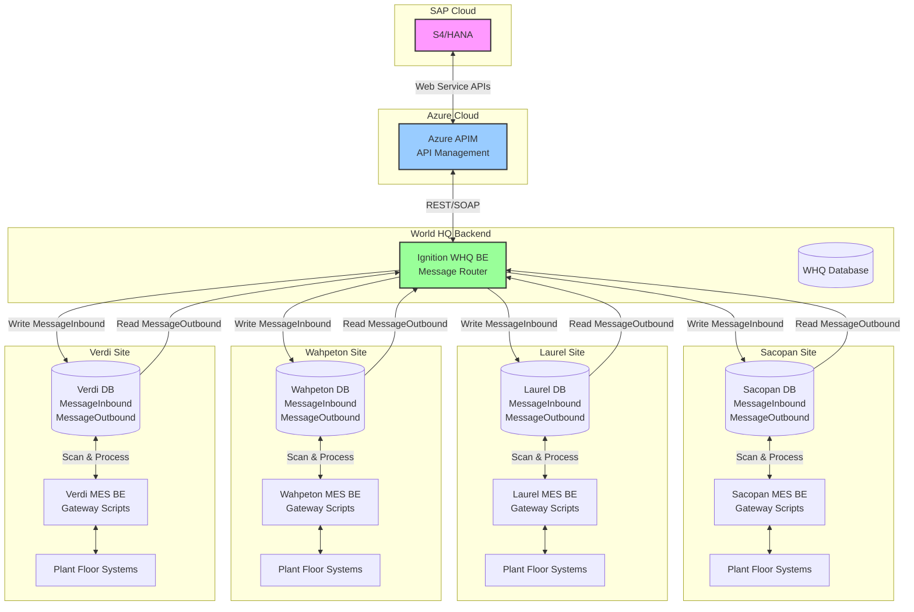

# SAP S4/HANA Integration Proposal
## Project Phoenix - Doors Division Integration

---

### Executive Summary

This proposal addresses the SAP S4/HANA integration requirements for Owens Corning's Project Phoenix, focusing on the migration of four Masonite doors manufacturing facilities to the S4/HANA platform. Given the critical uncertainties identified in our analysis, we propose a risk-managed, phased approach that prioritizes proven technologies while maintaining flexibility for emerging solutions.

**Key Proposal Elements:**
- Dual-path architecture supporting both REST API and Kafka integration
- Comprehensive error handling to support S4's "Clean Core" principle
- Phased deployment strategy with clear go/no-go decision points
- Production-ready fallback options for all critical components

---

## 1. Integration Architecture

### 1.1 Proposed Dual-Path Strategy

Given the unproven nature of Ignition 8.3's Event Streams module and the aggressive timeline, we propose implementing parallel integration paths:

#### Primary Path Architecture (Production-Ready)



**Primary Path Message Flow:**

1. **Downstream (S4 → Sites):**
   - S4/HANA publishes production orders and master data
   - Azure APIM receives and routes messages to WHQ BE
   - WHQ BE Ignition instance processes and distributes messages
   - Messages written to each site's MessageInbound table
   - Site gateway scripts scan MessageInbound table continuously
   - Local processing and plant floor integration occurs
   - Results written to MessageOutbound table

2. **Upstream (Sites → S4):**
   - Site operations generate confirmations/transactions
   - Gateway scripts write to MessageOutbound table
   - WHQ BE scans all site MessageOutbound tables
   - WHQ consolidates and validates messages
   - Sends to APIM for S4/HANA processing
   - Handles responses and error management

**Message Table Architecture:**

```sql
-- MessageInbound Table Structure
CREATE TABLE MessageInbound (
    message_id SERIAL PRIMARY KEY,
    message_type VARCHAR(50),
    payload JSONB,
    source_system VARCHAR(50),
    target_site VARCHAR(50),
    created_timestamp TIMESTAMP,
    processed_flag BOOLEAN DEFAULT FALSE,
    processed_timestamp TIMESTAMP,
    retry_count INTEGER DEFAULT 0,
    error_message TEXT
);

-- MessageOutbound Table Structure  
CREATE TABLE MessageOutbound (
    message_id SERIAL PRIMARY KEY,
    message_type VARCHAR(50),
    payload JSONB,
    source_site VARCHAR(50),
    target_system VARCHAR(50),
    created_timestamp TIMESTAMP,
    transmitted_flag BOOLEAN DEFAULT FALSE,
    transmitted_timestamp TIMESTAMP,
    retry_count INTEGER DEFAULT 0,
    response_payload JSONB,
    status VARCHAR(20)
);
```

**Rationale for Primary Path:**
- Proven message queue pattern with database persistence
- Reliable store-and-forward mechanism
- Site autonomy during network disruptions
- Traceable message flow with full audit trail
- Simplified troubleshooting and recovery
- No dependency on unproven Event Streams technology

#### Gateway Script Processing Pattern

**WHQ BE Message Router Scripts:**

```python
# Scheduled script running every 30 seconds
def distributeInboundMessages():
    """WHQ BE: Distribute S4 messages to appropriate sites"""
    messages = system.db.runQuery("SELECT * FROM sap_messages WHERE distributed = false")
    
    for message in messages:
        site = determineTargetSite(message)
        payload = {
            'order_number': message['order_number'],
            'material': message['material'],
            'quantity': message['quantity'],
            'routing': message['routing']
        }
        
        # Write to site's MessageInbound table
        siteDB = f"{site}_MES_DB"
        system.db.runPrepUpdate(
            "INSERT INTO MessageInbound (message_type, payload, source_system, target_site) VALUES (?,?,?,?)",
            [message['type'], json.dumps(payload), 'S4_HANA', site],
            database=siteDB
        )
        
        # Mark as distributed
        system.db.runPrepUpdate(
            "UPDATE sap_messages SET distributed = true WHERE id = ?",
            [message['id']]
        )
```

**Site MES BE Processing Scripts:**

```python
# Site gateway script running every 10 seconds
def processInboundMessages():
    """Site MES: Process messages from WHQ"""
    unprocessed = system.db.runQuery(
        "SELECT * FROM MessageInbound WHERE processed_flag = false ORDER BY created_timestamp"
    )
    
    for message in unprocessed:
        try:
            if message['message_type'] == 'PRODUCTION_ORDER':
                processProductionOrder(message['payload'])
            elif message['message_type'] == 'MATERIAL_MASTER':
                updateMaterialMaster(message['payload'])
            
            # Mark as processed
            system.db.runPrepUpdate(
                "UPDATE MessageInbound SET processed_flag = true, processed_timestamp = CURRENT_TIMESTAMP WHERE message_id = ?",
                [message['message_id']]
            )
        except Exception as e:
            # Log error and increment retry count
            handleProcessingError(message['message_id'], str(e))
```

**Site Outbound Message Generation:**

```python
def createConfirmationMessage(orderNumber, quantity, workCenter):
    """Site MES: Create confirmation message for S4"""
    payload = {
        'order_number': orderNumber,
        'confirmed_quantity': quantity,
        'work_center': workCenter,
        'timestamp': system.date.now(),
        'site': system.tag.read('[System]Client/Network/Hostname').value
    }
    
    system.db.runPrepUpdate(
        "INSERT INTO MessageOutbound (message_type, payload, source_site, target_system) VALUES (?,?,?,?)",
        ['PRODUCTION_CONFIRMATION', json.dumps(payload), site_name, 'S4_HANA']
    )
```

#### Future Path Architecture (Kafka/Event Streams)

Once Ignition 8.3 Event Streams module is validated and production-ready, the architecture will evolve to leverage real-time event streaming:

```mermaid
graph TB
    subgraph "SAP Cloud"
        S4[S4/HANA]
        DS[SAP Datasphere<br/>Kafka Topic Manager]
    end
    
    subgraph "Kafka Infrastructure"
        KT1[Production Orders Topic]
        KT2[Material Master Topic]
        KT3[Confirmations Topic]
        KT4[Goods Movement Topic]
        KT5[Quality Data Topic]
    end
    
    subgraph "Ignition 8.3 Infrastructure"
        subgraph "Event Streams Layer"
            ES[Event Streams Module<br/>Kafka Consumer/Producer]
            UDT1[Production Order UDT]
            UDT2[Confirmation UDT]
            UDT3[Material UDT]
            UDT4[Movement UDT]
        end
    end
    
    subgraph "Site MES Systems"
        SMES2[Sacopan MES]
        LMES2[Laurel MES]
        WMES2[Wahpeton MES]
        VMES2[Verdi MES]
    end
    
    subgraph "Plant Floor"
        PLCs[PLCs/Equipment<br/>Direct Integration]
        SCADA[SCADA Systems]
        Sensors[Smart Sensors]
    end
    
    S4 <--> |Native Integration| DS
    DS --> |Publish| KT1
    DS --> |Publish| KT2
    DS <-- |Subscribe| KT3
    DS <-- |Subscribe| KT4
    DS <-- |Subscribe| KT5
    
    ES --> |Subscribe| KT1
    ES --> |Subscribe| KT2
    ES <-- |Publish| KT3
    ES <-- |Publish| KT4
    ES <-- |Publish| KT5
    
    ES <--> UDT1
    ES <--> UDT2
    ES <--> UDT3
    ES <--> UDT4
    
    UDT1 --> SMES2
    UDT1 --> LMES2
    UDT1 --> WMES2
    UDT1 --> VMES2
    
    SMES2 <--> PLCs
    LMES2 <--> SCADA
    WMES2 <--> Sensors
    VMES2 <--> PLCs
    
    PLCs --> |Direct Events| UDT2
    SCADA --> |Quality Events| UDT3
    Sensors --> |Movement Events| UDT4
    
    style S4 fill:#f9f,stroke:#333,stroke-width:2px
    style DS fill:#fcf,stroke:#333,stroke-width:2px
    style ES fill:#9f9,stroke:#333,stroke-width:2px
```

**Future Path Key Components:**

1. **SAP Datasphere Integration:**
   - Datasphere acts as the integration layer with S4/HANA
   - All S4 data streams exposed as Kafka topics
   - Handles complex S4 transformations and business logic
   - Provides topic governance and schema management

2. **Kafka Topics Structure:**
   ```yaml
   Production Orders Topic:
     - Schema: Avro/JSON Schema Registry
     - Partitioning: By plant/work center
     - Retention: 7 days
     - Throughput: 1000 msg/sec
   
   Confirmations Topic:
     - Schema: Standardized confirmation format
     - Partitioning: By order number
     - Retention: 30 days
     - Throughput: 5000 msg/sec
   ```

3. **Ignition Event Streams UDTs:**
   ```python
   # Production Order UDT Structure
   ProductionOrderUDT = {
       'OrderNumber': String,
       'Material': String,
       'Quantity': Float,
       'UOM': String,
       'WorkCenter': String,
       'PlannedStart': DateTime,
       'PlannedEnd': DateTime,
       'Priority': Integer,
       'CustomerOrder': String,
       'EventTimestamp': DateTime,
       'EventType': String  # CREATE, UPDATE, RELEASE, CLOSE
   }
   
   # Confirmation UDT Structure
   ConfirmationUDT = {
       'OrderNumber': String,
       'Operation': String,
       'ConfirmedQty': Float,
       'ScrapQty': Float,
       'WorkCenter': String,
       'Timestamp': DateTime,
       'OperatorID': String,
       'AutoConfirm': Boolean,
       'MachineID': String,
       'EventType': String  # START, PARTIAL, FINAL
   }
   
   # Material Movement UDT
   MaterialMovementUDT = {
       'MovementType': String,
       'Material': String,
       'Quantity': Float,
       'FromLocation': String,
       'ToLocation': String,
       'BatchNumber': String,
       'Timestamp': DateTime,
       'EventType': String  # GOODS_RECEIPT, GOODS_ISSUE, TRANSFER
   }
   ```

4. **Direct Machine Integration:**
   - PLCs publish directly to Event Streams via UDTs
   - Automatic confirmations triggered by production events
   - Real-time quality data streaming
   - No intermediate database polling required

**Advantages of Future Path:**
- Real-time data flow (sub-second latency)
- Scalable to thousands of devices
- Event-driven architecture
- Reduced database load
- Native S4 integration via Datasphere
- Standardized data models via UDTs
- Automatic schema evolution support

**Migration Strategy from Primary to Future Path:**
1. Run both paths in parallel initially
2. Gradually migrate topic by topic
3. Validate data consistency
4. Sunset database polling once stable
5. Full cutover after 3-month parallel run

**Prerequisites for Future Path:**
- Ignition 8.3 stable release
- Event Streams module production validation
- Datasphere Kafka topics configured
- Network bandwidth upgraded (10x current)
- Kafka infrastructure deployed
- Schema registry implemented
- UDT templates developed and tested

### 1.2 Core Integration Transactions

The system will support four critical S4/HANA transactions:

#### Transaction 1: Production Order Download
- **Direction:** S4/HANA → Ignition
- **Method:** REST API polling (initial) / Kafka subscription (future)
- **Frequency:** Every 5 minutes or on-demand
- **Data Elements:**
  - Order number, material, quantity
  - Routing/operations with work centers
  - Control keys (auto-confirmation flags)
  - MTO configuration and customer specifications
- **Error Handling:** Retry with exponential backoff, local queue on failure

#### Transaction 2: Production Confirmation
- **Direction:** Ignition → S4/HANA
- **API:** OP_API_PROD_ORDER_CONFIRMATIO_2_SRV_0001
- **Trigger:** Operator confirmation or automatic count threshold
- **Critical Features:**
  - Generates automatic goods receipt
  - Creates IBD for EWM storage locations
  - Supports partial confirmations
  - Rollback capability for failed transactions

#### Transaction 3: Goods Movement
- **Direction:** Ignition → S4/HANA
- **APIs:** 
  - OP_HANDLINGUNIT_0001 (HU Creation)
  - OP_HANDLINGUNIT_0001 (Pack HU)
  - OP_API_INBOUND_DELIVERY_SRV_0002 (Post GR)
- **Process:** Sequential 3-step process with transaction integrity
- **Error Recovery:** Compensation logic for partial failures

#### Transaction 4: Order Status Updates
- **Direction:** Bidirectional
- **Purpose:** Synchronize order status between shop floor and S4
- **Frequency:** Real-time on status change
- **States:** Released, Started, Completed, Held, Cancelled

### 1.3 Authentication & Security

**Proposed Security Architecture:**
- OAuth 2.0 authentication with Azure AD integration
- Certificate-based service authentication for production
- API key management with rotation policy
- Encrypted credential storage in Ignition
- Rate limiting and throttling compliance

---

## 2. Error Handling Strategy (Clean Core Compliance)

### 2.1 Comprehensive Error Management

Since S4/HANA's "Clean Core" principle prohibits custom error handling within SAP, Ignition assumes full responsibility for error management:

**Error Categories & Handling:**

| Error Type | Detection Method | Recovery Strategy | User Notification |
|------------|-----------------|-------------------|-------------------|
| Network Failures | Timeout/Connection Error | Queue & Retry (5 attempts) | Dashboard Alert |
| API Rate Limits | HTTP 429 Response | Exponential Backoff | Warning Message |
| Business Logic Errors | SAP Error Codes | Parse & Display Requirements | Operator Action Required |
| Data Validation | Pre-submission Check | Prevent Submission | Inline Validation |
| Transaction Failures | Partial Success | Compensation Logic | Supervisor Escalation |
| Authentication | Token Expiry | Automatic Refresh | Only on Failure |

### 2.2 Transaction Integrity Management

**Four-Step Confirmation Process Integrity:**
```python
# Pseudo-code for transaction management
transaction_state = {
    'order_confirmed': False,
    'hu_created': False,
    'hu_packed': False,
    'gr_posted': False
}

# Each step validates previous steps
# Automatic rollback on failure
# Audit trail for all attempts
```

**Compensation Logic:**
- Step 4 fails → Unpack HU (Step 3 reverse)
- Step 3 fails → Delete HU (Step 2 reverse)
- Step 2 fails → Cancel confirmation (Step 1 reverse)
- Full audit trail maintained in Ignition

### 2.3 Error Recovery Queue

**Persistent Queue Implementation:**
- Local PostgreSQL database for failed transactions
- Automatic retry with configurable intervals
- Manual intervention options
- Age-based escalation
- Batch recovery tools

---

## 3. Data Caching & Offline Operation

### 3.1 Local Cache Architecture

**Cache Levels:**
1. **Level 1 - Critical Data** (Always cached)
   - Active production orders
   - Material master data
   - Work center configurations
   - Last 24 hours of confirmations

2. **Level 2 - Operational Data** (Cached on-demand)
   - Historical orders (7 days)
   - Quality specifications
   - Customer requirements

3. **Level 3 - Reference Data** (Periodic sync)
   - Full material catalog
   - Customer database
   - Routing libraries

### 3.2 Offline Operation Capabilities

**Offline Functionality Matrix:**

| Function | Offline Capability | Data Sync on Reconnect | Business Impact |
|----------|-------------------|------------------------|-----------------|
| View Orders | Full | Not Required | None |
| Create Confirmations | Full | Queued Upload | Delayed Visibility |
| Print Labels | Full | Not Required | None |
| Goods Movement | Limited | Full Reconciliation | Inventory Variance |
| Status Updates | Cached | Bidirectional Sync | Temporary Mismatch |

**Conflict Resolution:**
- S4/HANA is system of record
- Local changes queued with timestamps
- Supervisor approval for conflicts
- Automated resolution for non-conflicts

---

## 4. Performance & Scalability

### 4.1 Performance Targets

**System Performance Requirements:**
- API response time: < 2 seconds (95th percentile)
- Order download: < 30 seconds for 100 orders
- Confirmation posting: < 5 seconds per transaction
- Cache synchronization: < 5 minutes for full sync
- UI responsiveness: < 500ms for user actions

### 4.2 Scalability Design

**Per-Site Capacity Planning:**
- 500 production orders per day
- 2,000 confirmations per day
- 50 concurrent users
- 10,000 API calls per day

**Multi-Site Architecture:**
```
[S4/HANA Cloud]
       |
   [APIM/Gateway]
    /    |    \
[Site 1] [Site 2] [Site 3] [Site 4]
(Ignition Instances with Local Cache)
```

---

## 5. Implementation Approach

### 5.1 Phase 1: Foundation (Months 1-3)
**Objective:** Establish core integration with proven technology

**Deliverables:**
- REST API integration framework
- Production order download and display
- Manual confirmation interface
- Basic error handling and logging
- Local cache implementation

**Success Criteria:**
- Successfully download orders from S4/HANA
- Complete full 4-step confirmation process
- Demonstrate offline operation
- Pass integration testing

### 5.2 Phase 2: Enhancement (Months 4-5)
**Objective:** Add automation and optimization

**Deliverables:**
- Automatic confirmation triggers
- Advanced error recovery
- Performance optimization
- Batch processing capabilities
- Enhanced monitoring dashboard

**Success Criteria:**
- 50% reduction in manual confirmations
- Error recovery rate > 95%
- Meet all performance targets

### 5.3 Phase 3: Advanced Features (Month 6+)
**Objective:** Implement advanced capabilities if time permits

**Deliverables:**
- Kafka/Event Streams integration (if stable)
- Predictive order management
- Advanced analytics
- Machine learning optimization

**Go/No-Go Decision:** Based on Ignition 8.3 stability assessment

---

## 6. Risk Management

### 6.1 Critical Risks & Mitigation

| Risk | Probability | Impact | Mitigation Strategy | Owner |
|------|------------|--------|-------------------|--------|
| Ignition 8.3 Event Streams Instability | HIGH | CRITICAL | REST API primary path | Grantek |
| APIM/Kafka Not Ready | MEDIUM | HIGH | Direct S4 connection option | OC IT |
| API Performance Issues | MEDIUM | MEDIUM | Caching and batch processing | Grantek |
| Network Reliability | MEDIUM | HIGH | Offline operation capability | Joint |
| February 2026 Timeline | HIGH | CRITICAL | Phased deployment approach | Joint |

### 6.2 Contingency Plans

**Scenario Planning:**
1. **Kafka not available by October 2025**
   - Continue with REST API only
   - Plan Kafka migration for Phase 2

2. **S4/HANA API changes**
   - Abstraction layer for API calls
   - Version management strategy
   - Regression test suite

3. **Performance degradation**
   - Horizontal scaling ready
   - Database optimization plan
   - CDN for static content

---

## 7. Technical Requirements

### 7.1 Infrastructure Requirements

**Per Site:**
- Ignition Gateway Server (8GB RAM, 4 CPU cores minimum)
- PostgreSQL Database Server (16GB RAM, 500GB storage)
- Redundant gateway for high availability
- Gigabit network connectivity
- UPS power protection

**Centralized:**
- Development environment
- Test environment matching production
- CI/CD pipeline infrastructure
- Monitoring and logging platform

### 7.2 Software Stack

**Core Components:**
- Ignition 8.1.x (stable) with upgrade path to 8.3
- PostgreSQL 14+ for local caching
- Python 3.9+ for scripting
- Docker for containerization (optional)
- Git for version control

---

## 8. Testing Strategy

### 8.1 Test Phases

1. **Unit Testing** (Continuous)
   - API integration functions
   - Error handling logic
   - Data transformation

2. **Integration Testing** (Monthly)
   - End-to-end transaction flows
   - Error recovery scenarios
   - Performance benchmarks

3. **User Acceptance Testing** (Pre-deployment)
   - Business process validation
   - Operator training scenarios
   - Failure mode testing

4. **Parallel Run** (2 weeks before go-live)
   - Shadow mode operation
   - Data validation
   - Performance monitoring

### 8.2 Test Environment Requirements

- S4/HANA test instance with production-like data
- Network simulation for latency/failure testing
- Load testing tools for scalability validation
- Automated test execution framework

---

## 9. Deliverables

### 9.1 Software Deliverables

1. **Ignition Project Files**
   - Gateway configuration
   - Tag structures
   - Screen templates
   - Script libraries

2. **Integration Components**
   - REST API client library
   - Error handling framework
   - Cache management system
   - Queue processing engine

3. **Monitoring & Reporting**
   - Performance dashboards
   - Error tracking system
   - Transaction audit reports
   - KPI visualizations

### 9.2 Documentation Deliverables

1. **Technical Documentation**
   - Architecture diagrams
   - API specifications
   - Database schemas
   - Configuration guides

2. **Operational Documentation**
   - Administrator guides
   - Troubleshooting procedures
   - Disaster recovery plans
   - Performance tuning guides

3. **End User Documentation**
   - Operator manuals
   - Quick reference cards
   - Training materials
   - Video tutorials

---

## 10. Success Metrics

### 10.1 Key Performance Indicators

**Technical KPIs:**
- System availability > 99.5%
- API success rate > 98%
- Average transaction time < 3 seconds
- Error recovery rate > 95%
- Cache hit ratio > 80%

**Business KPIs:**
- Order visibility within 5 minutes
- Confirmation accuracy > 99.9%
- Operator productivity increase > 20%
- Manual intervention reduction > 50%
- Training time reduction > 30%

### 10.2 Acceptance Criteria

**Go-Live Requirements:**
- All critical transactions operational
- 48-hour stability test passed
- Offline operation validated
- Performance targets met
- Operator training completed
- Rollback plan tested

---

## 11. Assumptions & Dependencies

### 11.1 Key Assumptions

1. S4/HANA APIs will be available for testing by project start
2. Test environment will mirror production configuration
3. Network infrastructure meets minimum requirements
4. Plant floor systems accessible via standard protocols
5. Resource availability as planned

### 11.2 Critical Dependencies

**From Owens Corning:**
- S4/HANA test instance access
- API documentation and credentials
- Network connectivity setup
- Business process documentation
- Subject matter expert availability

**From Third Parties:**
- APIM configuration (if required)
- Kafka infrastructure (if implemented)
- Firewall rule changes
- Certificate provisioning

---

## 12. Timeline & Milestones

### 12.1 Detailed Timeline

| Milestone | Date | Deliverable | Success Criteria |
|-----------|------|-------------|------------------|
| Project Kickoff | July 2025 | Project plan approved | Resources allocated |
| Phase 1 Complete | Sept 2025 | Core integration operational | Orders flowing |
| Integration Testing | Oct 2025 | Test scenarios executed | 95% pass rate |
| Phase 2 Complete | Nov 2025 | Automation features live | KPIs improving |
| UAT Complete | Dec 19, 2025 | User sign-off | Business approval |
| Parallel Run | Jan 2026 | Shadow mode validation | Data accuracy verified |
| Go-Live | Feb 6, 2026 | Production cutover | System operational |
| Stabilization | Feb-Mar 2026 | Support and optimization | Issues resolved |

### 12.2 Critical Path Items

1. S4/HANA API access and documentation
2. Network infrastructure readiness
3. Test environment availability
4. Integration development and testing
5. Operator training completion

---

## Conclusion

This SAP S4/HANA integration proposal provides a robust, risk-managed approach to achieving Project Phoenix objectives. By implementing a dual-path architecture with proven REST API technology as the primary integration method, we ensure the February 2026 deadline can be met regardless of emerging technology readiness. The comprehensive error handling framework fully supports S4's "Clean Core" principle, while the phased implementation approach allows for controlled deployment and risk mitigation.

Our solution prioritizes production readiness over bleeding-edge technology adoption, ensuring Owens Corning can successfully integrate the Masonite facilities while maintaining operational continuity and system reliability.

---

*This proposal section addresses the SAP S4/HANA integration requirements for Project Phoenix. Additional proposal sections for Response Files, Automatic Confirmations, PI Integration, and Driver Check-in System should be developed as separate focused documents.*