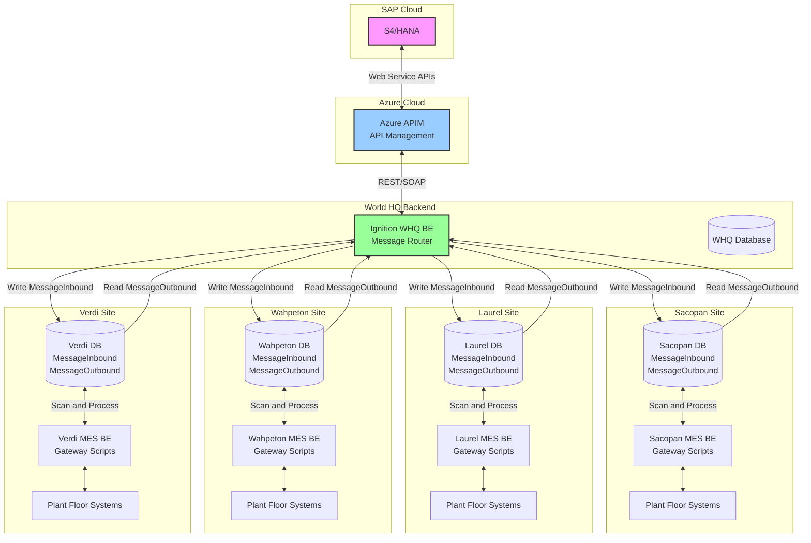
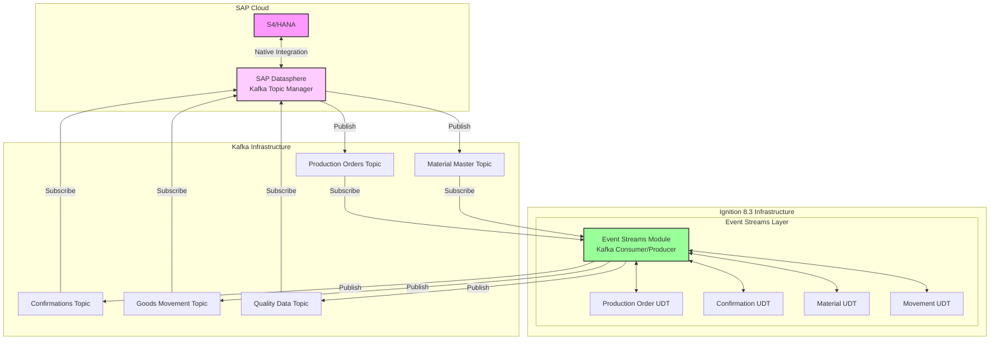

# SAP S4/HANA Integration Proposal
## Project Phoenix - Doors Division Integration

---

### Executive Summary

This proposal addresses the SAP S4/HANA integration requirements for Owens Corning's Project Phoenix, focusing on the migration of four Masonite doors manufacturing facilities to the S4/HANA platform. Given the critical uncertainties identified in our analysis, we propose a risk-managed, phased approach that prioritizes proven technologies while maintaining flexibility for emerging solutions.

**Key Proposal Elements:**
- Dual-path architecture supporting both REST API and Kafka integration
- Comprehensive error handling to support S4's "Clean Core" principle
- Phased deployment strategy with clear go/no-go decision points
- Production-ready fallback options for all critical components

---

## 1. Integration Architecture

### 1.1 Proposed Dual-Path Strategy

Given the unproven nature of Ignition 8.3's Event Streams module and the aggressive timeline, we propose implementing parallel integration paths:

#### Primary Path Architecture (Production-Ready)



**Primary Path Message Flow:**

1. **Downstream (S4 → Sites):**
   - S4/HANA publishes production orders and master data
   - Azure APIM receives and routes messages to WHQ BE
   - WHQ BE Ignition instance processes and distributes messages
   - Messages written to each site's MessageInbound table
   - Site gateway scripts scan MessageInbound table continuously
   - Local processing and plant floor integration occurs
   - Results written to MessageOutbound table

2. **Upstream (Sites → S4):**
   - Site operations generate confirmations/transactions
   - Gateway scripts write to MessageOutbound table
   - WHQ BE scans all site MessageOutbound tables
   - WHQ consolidates and validates messages
   - Sends to APIM for S4/HANA processing
   - Handles responses and error management

**Message Table Architecture:**

```sql
-- MessageInbound Table Structure
CREATE TABLE MessageInbound (
    message_id SERIAL PRIMARY KEY,
    message_type VARCHAR(50),
    payload JSONB,
    source_system VARCHAR(50),
    target_site VARCHAR(50),
    created_timestamp TIMESTAMP,
    processed_flag BOOLEAN DEFAULT FALSE,
    processed_timestamp TIMESTAMP,
    retry_count INTEGER DEFAULT 0,
    error_message TEXT
);

-- MessageOutbound Table Structure  
CREATE TABLE MessageOutbound (
    message_id SERIAL PRIMARY KEY,
    message_type VARCHAR(50),
    payload JSONB,
    source_site VARCHAR(50),
    target_system VARCHAR(50),
    created_timestamp TIMESTAMP,
    transmitted_flag BOOLEAN DEFAULT FALSE,
    transmitted_timestamp TIMESTAMP,
    retry_count INTEGER DEFAULT 0,
    response_payload JSONB,
    status VARCHAR(20)
);
```

**Rationale for Primary Path:**
- Proven message queue pattern with database persistence
- Reliable store-and-forward mechanism
- Site autonomy during network disruptions
- Traceable message flow with full audit trail
- Simplified troubleshooting and recovery
- No dependency on unproven Event Streams technology

#### Gateway Script Processing Pattern

**WHQ BE Message Router Scripts:**

```python
# Scheduled script running every 30 seconds
def distributeInboundMessages():
    """WHQ BE: Distribute S4 messages to appropriate sites"""
    messages = system.db.runQuery("SELECT * FROM sap_messages WHERE distributed = false")
    
    for message in messages:
        site = determineTargetSite(message)
        payload = {
            'order_number': message['order_number'],
            'material': message['material'],
            'quantity': message['quantity'],
            'routing': message['routing']
        }
        
        # Write to site's MessageInbound table
        siteDB = f"{site}_MES_DB"
        system.db.runPrepUpdate(
            "INSERT INTO MessageInbound (message_type, payload, source_system, target_site) VALUES (?,?,?,?)",
            [message['type'], json.dumps(payload), 'S4_HANA', site],
            database=siteDB
        )
        
        # Mark as distributed
        system.db.runPrepUpdate(
            "UPDATE sap_messages SET distributed = true WHERE id = ?",
            [message['id']]
        )
```

**Site MES BE Processing Scripts:**

```python
# Site gateway script running every 10 seconds
def processInboundMessages():
    """Site MES: Process messages from WHQ"""
    unprocessed = system.db.runQuery(
        "SELECT * FROM MessageInbound WHERE processed_flag = false ORDER BY created_timestamp"
    )
    
    for message in unprocessed:
        try:
            if message['message_type'] == 'PRODUCTION_ORDER':
                processProductionOrder(message['payload'])
            elif message['message_type'] == 'MATERIAL_MASTER':
                updateMaterialMaster(message['payload'])
            
            # Mark as processed
            system.db.runPrepUpdate(
                "UPDATE MessageInbound SET processed_flag = true, processed_timestamp = CURRENT_TIMESTAMP WHERE message_id = ?",
                [message['message_id']]
            )
        except Exception as e:
            # Log error and increment retry count
            handleProcessingError(message['message_id'], str(e))
```

**Site Outbound Message Generation:**

```python
def createConfirmationMessage(orderNumber, quantity, workCenter):
    """Site MES: Create confirmation message for S4"""
    payload = {
        'order_number': orderNumber,
        'confirmed_quantity': quantity,
        'work_center': workCenter,
        'timestamp': system.date.now(),
        'site': system.tag.read('[System]Client/Network/Hostname').value
    }
    
    system.db.runPrepUpdate(
        "INSERT INTO MessageOutbound (message_type, payload, source_site, target_system) VALUES (?,?,?,?)",
        ['PRODUCTION_CONFIRMATION', json.dumps(payload), site_name, 'S4_HANA']
    )
```

#### Future Path Architecture (Kafka/Event Streams)

Once Ignition 8.3 Event Streams module is validated and production-ready, the architecture will evolve to leverage real-time event streaming:



**Future Path Key Components:**

1. **SAP Datasphere Integration:**
   - Datasphere acts as the integration layer with S4/HANA
   - All S4 data streams exposed as Kafka topics
   - Handles complex S4 transformations and business logic
   - Provides topic governance and schema management

2. **Kafka Topics Structure (Project Phoenix Scope Only):**
   ```yaml
   # Core Topics - Aligned with 4-Step SAP Transaction Process
   
   doors.production.orders:
     description: "Production orders from S4/HANA for Doors Division"
     api_source: "S4/HANA Production Orders API"
     schema: 
       type: "avro"
       registry: "SAP Schema Registry"
       version: "v1.0"
     partitioning: 
       strategy: "plant-code"
       partitions: 4  # One per site
       key: "${plant_code}"
     retention: 
       time: "7 days"
       size: "2 GB"
     throughput:
       estimated: "100 msg/sec peak"
       guaranteed: "50 msg/sec sustained"
     site_routing:
       - "QC01" → doors.sacopan.orders
       - "MS01" → doors.laurel.orders  
       - "ND01" → doors.wahpeton.orders
       - "NV01" → doors.verdi.orders
   
   doors.production.confirmations:
     description: "Production confirmations using OP_API_PROD_ORDER_CONFIRMATIO_2_SRV_0001"
     api_target: "OP_API_PROD_ORDER_CONFIRMATIO_2_SRV_0001"
     schema:
       type: "avro"
       registry: "SAP Schema Registry"  
       version: "v1.0"
     partitioning:
       strategy: "plant-order"
       partitions: 8
       key: "${plant_code}-${order_number}"
     retention:
       time: "30 days"
       size: "5 GB"
     throughput:
       estimated: "500 msg/sec peak"
       guaranteed: "200 msg/sec sustained"
     transaction_flow: "Step 1 of 4-step process"
     dead_letter_queue: "doors.confirmations.dlq"
   
   doors.handling.units:
     description: "HU creation and packing using OP_HANDLINGUNIT_0001"
     api_target: "OP_HANDLINGUNIT_0001"
     schema:
       type: "avro"
       registry: "SAP Schema Registry"
       version: "v1.0"
     partitioning:
       strategy: "plant-code"
       partitions: 4
       key: "${plant_code}"
     retention:
       time: "30 days"
       size: "3 GB"
     throughput:
       estimated: "300 msg/sec peak"
       guaranteed: "150 msg/sec sustained"
     transaction_flow: "Steps 2 & 3 of 4-step process"
     operations:
       - "CREATE_HU" # Step 2
       - "PACK_HU"   # Step 3
   
   doors.goods.receipts:
     description: "Goods receipts using OP_API_INBOUND_DELIVERY_SRV_0002"
     api_target: "OP_API_INBOUND_DELIVERY_SRV_0002/PostGoodsReceipt"
     schema:
       type: "avro"
       registry: "SAP Schema Registry"
       version: "v1.0"
     partitioning:
       strategy: "plant-code"
       partitions: 4
       key: "${plant_code}"
     retention:
       time: "90 days"
       size: "4 GB"
     throughput:
       estimated: "200 msg/sec peak"
       guaranteed: "100 msg/sec sustained"
     transaction_flow: "Step 4 of 4-step process"
   
   # Essential Support Topics
   
   doors.transaction.status:
     description: "4-step transaction status tracking and recovery"
     schema:
       type: "json"
       registry: "Transaction Registry"
       version: "v1.0"
     partitioning:
       strategy: "transaction-id"
       partitions: 8
       key: "${transaction_id}"
     retention:
       time: "30 days"
       size: "1 GB"
     monitoring:
       track_completion: "All 4 steps"
       timeout_alerts: "Step incomplete after 10 minutes"
       recovery_triggers: "Failed step with rollback required"
   
   doors.errors.dlq:
     description: "Dead letter queue for failed transactions"
     schema:
       type: "envelope"
       contains: "original_message + error_metadata + retry_count"
     partitioning:
       strategy: "error-type"
       partitions: 4
       key: "${error_type}"
     retention:
       time: "30 days"
       size: "2 GB"
     monitoring:
       alerts: "immediate on message arrival"
       escalation: "after 5 failed messages of same type"
     recovery:
       manual_review: "Business logic errors"
       auto_retry: "Network/timeout errors"
   
   # Minimal Site-Specific Topics (Project Phoenix scope only)
   
   doors.sites.events:
     description: "Critical site events for 4 Doors Division facilities"
     schema:
       type: "json"
       registry: "Site Registry"
       version: "v1.0"
     partitioning:
       strategy: "site-code"
       partitions: 4
       key: "${site_code}"
     retention:
       time: "7 days"
       size: "500 MB"
     event_types:
       - "production_start"
       - "production_complete" 
       - "equipment_alarm"
       - "shift_change"
       # Laurel-specific only:
       - "driver_checkin" (MS01 only)
       - "scale_event" (MS01 only)
   ```

3. **Ignition Event Streams UDTs:**
   ```python
   # Production Order UDT Structure
   ProductionOrderUDT = {
       'OrderNumber': String,
       'Material': String,
       'Quantity': Float,
       'UOM': String,
       'WorkCenter': String,
       'PlannedStart': DateTime,
       'PlannedEnd': DateTime,
       'Priority': Integer,
       'CustomerOrder': String,
       'EventTimestamp': DateTime,
       'EventType': String  # CREATE, UPDATE, RELEASE, CLOSE
   }
   
   # Confirmation UDT Structure
   ConfirmationUDT = {
       'OrderNumber': String,
       'Operation': String,
       'ConfirmedQty': Float,
       'ScrapQty': Float,
       'WorkCenter': String,
       'Timestamp': DateTime,
       'OperatorID': String,
       'AutoConfirm': Boolean,
       'MachineID': String,
       'EventType': String  # START, PARTIAL, FINAL
   }
   
   # Material Movement UDT
   MaterialMovementUDT = {
       'MovementType': String,
       'Material': String,
       'Quantity': Float,
       'FromLocation': String,
       'ToLocation': String,
       'BatchNumber': String,
       'Timestamp': DateTime,
       'EventType': String  # GOODS_RECEIPT, GOODS_ISSUE, TRANSFER
   }
   ```

4. **Direct Machine Integration:**
   - PLCs publish directly to Event Streams via UDTs
   - Automatic confirmations triggered by production events
   - Real-time quality data streaming
   - No intermediate database polling required

**Advantages of Future Path:**
- Real-time data flow (sub-second latency)
- Scalable to thousands of devices
- Event-driven architecture
- Reduced database load
- Native S4 integration via Datasphere
- Standardized data models via UDTs
- Automatic schema evolution support

**Migration Strategy from Primary to Future Path:**
1. Run both paths in parallel initially
2. Gradually migrate topic by topic
3. Validate data consistency
4. Sunset database polling once stable
5. Full cutover after 3-month parallel run

**Prerequisites for Future Path:**
- Ignition 8.3 stable release
- Event Streams module production validation
- Datasphere Kafka topics configured
- Kafka infrastructure deployed
- Schema registry implemented
- UDT templates developed and tested

### 1.2 Core Integration Transactions

The system will support the specific 4-step transaction sequence defined in the RFQ:

#### Transaction 1: Production Order Confirmation
- **Direction:** Ignition → S4/HANA
- **API:** `OP_API_PROD_ORDER_CONFIRMATIO_2_SRV_0001`
- **API Reference:** https://api.sap.com/api/OP_API_PROD_ORDER_CONFIRMATIO_2_SRV_0001/overview
- **Trigger:** Operator confirmation or automatic count threshold
- **Process:**
  - Confirms production quantities against production order
  - Automatically generates Goods Receipt (GR) 
  - Creates Inbound Delivery (IBD) if storage location is EWM-managed
  - Updates production order status and remaining quantities
- **Data Elements:**
  - Production order number
  - Operation sequence number
  - Confirmed quantity (good + scrap)
  - Work center and posting date
  - Batch/lot information
- **Error Handling:** Transaction rollback on failure, retry queue for network issues

#### Transaction 2: Handling Unit Creation
- **Direction:** Ignition → S4/HANA
- **API:** `OP_HANDLINGUNIT_0001` (CREATE operation)
- **API Reference:** https://api.sap.com/api/OP_HANDLINGUNIT_0001/overview
- **Trigger:** Successful production order confirmation
- **Process:**
  - Creates handling unit (HU) for confirmed production
  - Assigns HU number and HU type
  - Links HU to production order and material
  - Establishes packaging hierarchy if required
- **Data Elements:**
  - HU number (system-generated)
  - HU type and packaging material
  - Content quantity and material
  - Plant and storage location
- **Dependencies:** Requires successful Transaction 1 completion
- **Error Handling:** Delete/reverse HU creation on downstream failures

#### Transaction 3: Pack HU onto Inbound Delivery
- **Direction:** Ignition → S4/HANA
- **API:** `OP_HANDLINGUNIT_0001` (PACK operation)
- **API Reference:** https://api.sap.com/api/OP_HANDLINGUNIT_0001/overview
- **Trigger:** Successful HU creation
- **Process:**
  - Assigns handling unit to inbound delivery
  - Updates inbound delivery item quantities
  - Sets delivery status to "HU assigned"
  - Links physical package to logistics document
- **Data Elements:**
  - Handling unit number (from Transaction 2)
  - Inbound delivery number
  - Delivery item number
  - Packaging quantities
- **Dependencies:** Requires successful Transactions 1 & 2 completion
- **Error Handling:** Unpack HU from delivery on downstream failure

#### Transaction 4: Post Goods Receipt for Inbound Delivery
- **Direction:** Ignition → S4/HANA
- **API:** `OP_API_INBOUND_DELIVERY_SRV_0002` (PostGoodsReceipt)
- **API Reference:** https://api.sap.com/api/OP_API_INBOUND_DELIVERY_SRV_0002/path/post_PostGoodsReceipt
- **Trigger:** Successful HU packing to inbound delivery
- **Process:**
  - Posts final goods receipt for inbound delivery
  - Updates stock quantities in target storage location
  - Completes the EWM warehouse task (if applicable)
  - Finalizes the production-to-stock process
- **Data Elements:**
  - Inbound delivery number
  - Goods receipt quantities
  - Posting date and document date
  - Storage location and batch information
- **Dependencies:** Requires successful Transactions 1, 2 & 3 completion
- **Error Handling:** Reverse goods receipt on final validation failure

#### Critical Transaction Sequence Requirements

**Sequential Execution:**
```
Step 1: Production Confirmation → Creates GR + IBD (if EWM)
   ↓
Step 2: HU Creation → Creates handling unit for produced goods
   ↓  
Step 3: Pack HU → Assigns HU to inbound delivery
   ↓
Step 4: Post GR → Final goods receipt posting
```

**Transaction Integrity:**
- Each step validates previous step completion
- Failure at any step triggers compensation logic
- Complete audit trail maintained for all attempts
- Rollback procedures defined for each transaction type

**EWM Storage Location Handling:**
- System detects EWM-managed storage locations
- Automatically triggers IBD creation during confirmation
- Handles warehouse task creation and completion
- Supports both EWM and non-EWM scenarios seamlessly

### 1.3 Authentication & Security

**Proposed Security Architecture:**
- OAuth 2.0 authentication with Azure AD integration
- Certificate-based service authentication for production
- API key management with rotation policy
- Encrypted credential storage in Ignition
- Rate limiting and throttling compliance

---

## 2. Error Handling Strategy (Clean Core Compliance)

### 2.1 APIM-Aware Error Management Framework

The S4/HANA "Clean Core" principle requires all error handling to occur outside SAP. However, routing through Azure APIM creates an additional challenge: **limited visibility into actual SAP error responses**. Our error handling strategy addresses this multi-layered architecture:

```
Ignition → APIM → SAP S4/HANA
   ↑         ↑        ↑
Error     APIM      SAP Error
Handler   Wrapper   (Hidden)
```

**APIM Error Translation Challenge:**
- APIM may wrap, transform, or abstract actual SAP error codes
- HTTP status codes from APIM may not reflect true SAP business logic errors
- SAP-specific error details may be lost in APIM response transformation
- Timeout/retry logic must account for APIM proxy delays

### 2.2 Multi-Layered Error Detection & Classification

**Layer 1: APIM Response Analysis**
```python
# Error detection priority order
def analyze_apim_response(response):
    # 1. HTTP Status Code Analysis
    if response.status_code == 500:
        return "APIM_OR_SAP_SYSTEM_ERROR"  # Ambiguous - could be either
    elif response.status_code == 400:
        return "VALIDATION_ERROR"  # Could be APIM or SAP validation
    elif response.status_code == 429:
        return "APIM_RATE_LIMIT"  # Definitely APIM
    elif response.status_code == 504:
        return "APIM_TIMEOUT"  # APIM proxy timeout
    
    # 2. APIM Error Message Pattern Matching
    error_body = response.json()
    if "APIM" in error_body.get('source', ''):
        return classify_apim_error(error_body)
    elif "SAP" in error_body.get('error', {}).get('code', ''):
        return classify_sap_error(error_body)
    else:
        return "UNKNOWN_SOURCE_ERROR"  # Requires escalation
```

**Layer 2: SAP Business Logic Error Inference**
```python
# Infer SAP errors from APIM responses
def infer_sap_error(transaction_type, apim_response, transaction_data):
    """
    Since we cannot see raw SAP errors, infer likely SAP issues
    based on transaction context and APIM response patterns
    """
    if transaction_type == "PRODUCTION_CONFIRMATION":
        if "quantity" in apim_response.get('error', {}).get('message', ''):
            return {
                'likely_sap_error': 'CONFIRMATION_QUANTITY_INVALID',
                'business_action': 'Validate order remaining quantity',
                'user_message': 'Confirmation quantity exceeds order balance'
            }
    # Additional inference logic for each transaction type
```

**Layer 3: Transaction Context Error Validation**
```python
# Pre-validate transactions to prevent APIM/SAP errors
def validate_before_apim_call(transaction):
    """
    Comprehensive validation to catch errors before they reach APIM
    Reduces reliance on unclear APIM error responses
    """
    validations = [
        validate_order_exists(transaction.order_number),
        validate_quantity_available(transaction.confirmed_qty),
        validate_material_active(transaction.material),
        validate_plant_open(transaction.plant),
        validate_work_center_active(transaction.work_center)
    ]
    return aggregate_validation_results(validations)
```

### 2.3 Comprehensive Error Categories & Handling

| Error Source | Error Type | Detection Method | Recovery Strategy | Escalation |
|-------------|------------|------------------|-------------------|------------|
| **Network/Infrastructure** | Connection Timeout | HTTP timeout | Queue & retry (max 5x) | IT Operations |
| | DNS Resolution | Connection failure | Alternative endpoint | Network Team |
| **APIM Layer** | Rate Limiting | HTTP 429 | Exponential backoff | APIM Admin |
| | Authentication | HTTP 401/403 | Token refresh | Security Team |
| | Proxy Timeout | HTTP 504 | Extend timeout, retry | APIM Admin |
| | Transformation Error | HTTP 500 + APIM signature | Log for APIM team | APIM Support |
| **SAP S4/HANA (Inferred)** | Business Logic | Pattern matching in APIM response | User correction required | Business User |
| | Data Validation | HTTP 400 + SAP patterns | Pre-validation enhancement | Application Team |
| | Lock/Concurrency | Timeout + retry patterns | Delayed retry with jitter | System Admin |
| | Authorization | HTTP 403 + SAP context | Role verification | SAP Security |
| **Transaction Integrity** | Partial Success | Mixed success/failure in 4-step | Compensation logic | Supervisor |
| | Sequence Violation | Step N fails, steps 1-N-1 succeeded | Rollback procedures | Technical Lead |

### 2.4 APIM-Specific Error Handling Patterns

**Pattern 1: APIM Wrapping Detection**
```python
def unwrap_apim_error(apim_response):
    """
    Attempt to extract original SAP error from APIM wrapper
    """
    # Check for nested error structures
    if 'innerError' in apim_response:
        return extract_sap_error(apim_response['innerError'])
    
    # Check for SAP error code patterns in message
    sap_error_pattern = re.search(r'[A-Z]{1,2}[0-9]{3}', apim_response.get('message', ''))
    if sap_error_pattern:
        return lookup_sap_error_code(sap_error_pattern.group())
    
    # Fallback to APIM error handling
    return handle_generic_apim_error(apim_response)
```

**Pattern 2: Timeout Disambiguation**
```python
def analyze_timeout_source(start_time, response_time, timeout_error):
    """
    Determine if timeout occurred at APIM or SAP level
    """
    if response_time < 30:  # APIM typically fails fast
        return "APIM_PROXY_TIMEOUT"
    elif response_time > 120:  # SAP business logic timeout
        return "SAP_PROCESSING_TIMEOUT" 
    else:
        return "NETWORK_LATENCY_TIMEOUT"
```

**Pattern 3: Retry Strategy for APIM Environment**
```python
class APIMRetryStrategy:
    def __init__(self):
        self.base_delay = 1  # seconds
        self.max_delay = 60  # seconds
        self.max_retries = 5
        
    def should_retry(self, error_type, attempt_count):
        # Never retry SAP business logic errors
        if error_type.startswith("SAP_BUSINESS_"):
            return False
            
        # Always retry APIM infrastructure issues
        if error_type in ["APIM_TIMEOUT", "APIM_CONNECTION_ERROR"]:
            return attempt_count < self.max_retries
            
        # Conditional retry for ambiguous errors
        if error_type == "HTTP_500_UNKNOWN_SOURCE":
            return attempt_count < 2  # Limited retries for unknown
            
        return False
    
    def get_delay(self, attempt_count, error_type):
        # Longer delays for SAP-inferred errors
        multiplier = 2 if error_type.startswith("SAP_") else 1
        return min(self.base_delay * (2 ** attempt_count) * multiplier, self.max_delay)
```

### 2.5 Enhanced Error Visibility & Monitoring

**APIM Error Correlation Framework:**
```python
def create_error_correlation_id(transaction):
    """
    Create correlation ID to track errors across APIM and Ignition
    """
    correlation_id = f"{transaction.order_number}_{transaction.timestamp}_{uuid.uuid4().hex[:8]}"
    
    # Include in APIM headers
    headers = {
        'X-Correlation-ID': correlation_id,
        'X-Source-System': 'Ignition-MES',
        'X-Transaction-Type': transaction.type,
        'X-Plant-Code': transaction.plant
    }
    
    return correlation_id, headers
```

**Error Analytics Dashboard:**
- **APIM Error Rate Trends:** Track APIM-specific vs SAP-inferred errors
- **Timeout Analysis:** Categorize timeout sources (network/APIM/SAP)
- **Business Logic Error Patterns:** Identify recurring SAP validation issues
- **Retry Success Rates:** Monitor effectiveness of retry strategies
- **Correlation ID Tracking:** End-to-end transaction tracing

### 2.2 Transaction Integrity Management

**Four-Step Confirmation Process Integrity:**
```python
# Pseudo-code for transaction management
transaction_state = {
    'order_confirmed': False,
    'hu_created': False,
    'hu_packed': False,
    'gr_posted': False
}

# Each step validates previous steps
# Automatic rollback on failure
# Audit trail for all attempts
```

**Compensation Logic:**
- Step 4 fails → Unpack HU (Step 3 reverse)
- Step 3 fails → Delete HU (Step 2 reverse)
- Step 2 fails → Cancel confirmation (Step 1 reverse)
- Full audit trail maintained in Ignition

### 2.3 Error Recovery Queue

**Persistent Queue Implementation:**
- Local PostgreSQL database for failed transactions
- Automatic retry with configurable intervals
- Manual intervention options
- Age-based escalation
- Batch recovery tools

---

## 3. Data Caching & Offline Operation

### 3.1 Local Cache Architecture

**Cache Levels:**
1. **Level 1 - Critical Data** (Always cached)
   - Active production orders
   - Material master data
   - Work center configurations
   - Last 24 hours of confirmations

2. **Level 2 - Operational Data** (Cached on-demand)
   - Historical orders (7 days)
   - Quality specifications
   - Customer requirements

3. **Level 3 - Reference Data** (Periodic sync)
   - Full material catalog
   - Customer database
   - Routing libraries

### 3.2 Offline Operation Capabilities

**Offline Functionality Matrix:**

| Function | Offline Capability | Data Sync on Reconnect | Business Impact |
|----------|-------------------|------------------------|-----------------|
| View Orders | Full | Not Required | None |
| Create Confirmations | Partial | Queued Upload | Delayed Visibility |
| Print Labels | Full | Not Required | None |

**Conflict Resolution:**
- S4/HANA is system of record
- Local changes queued with timestamps
- Supervisor approval for conflicts
- Automated resolution for non-conflicts

---

## 4. Performance & Scalability

### 4.1 Performance Targets

**System Performance Requirements:**
- API response time: < 2 seconds 
- Order download: < 30 seconds for 100 orders
- Confirmation posting: < 5 seconds per transaction
- Cache synchronization: < 5 minutes for full sync
- UI responsiveness: < 1000ms for user actions

### 4.2 Scalability Design

**Per-Site Capacity Planning:**
- 500 production orders per day
- 2,000 confirmations per day
- 50 concurrent users
- 10,000 API calls per day

**Multi-Site Architecture:**
```
[S4/HANA Cloud]
       |
   [APIM/Gateway]
    /    |    \
[Site 1] [Site 2] [Site 3] [Site 4]
(Ignition Instances with Local Cache)
```

---

## 5. Implementation Approach

### 5.1 Phase 1: Foundation (Months 1-3)
**Objective:** Establish core integration with proven technology

**Week 1-2: Infrastructure Setup**
- Deploy Ignition Gateway servers at all 4 sites
- Configure PostgreSQL databases with schema design
- Establish secure network connections to World HQ Gateway
- Set up development and test environments
- Configure SSL certificates and authentication

**Week 3-4: SAP API Integration**
- Implement REST API client with circuit breaker pattern
- Configure OAuth 2.0 authentication with SAP
- Build production order download functionality
- Create material master data synchronization
- Implement comprehensive logging and monitoring

**Week 5-8: Core Confirmation System**
- Develop manual confirmation interface in Perspective
- Implement 4-step confirmation process with transaction integrity
- Create error handling with automatic retry logic
- Build production order display and filtering
- Configure local caching for offline operation

**Week 9-14: Testing & Integration**
- Execute unit testing for all components
- Perform integration testing with SAP S4/HANA APIs
- Conduct user acceptance testing at pilot site
- Performance testing under production load
- Security penetration testing

**Deliverables:**
- REST API integration framework with resilience patterns
- Production order download and caching system
- Manual confirmation interface with full 4-step process
- Comprehensive error handling and recovery queue
- Local cache implementation with offline capabilities
- Database schema with audit trails
- Authentication and authorization framework
- Monitoring dashboards for system health

**Success Criteria:**
- Successfully download and display orders from S4/HANA
- Complete full 4-step confirmation process (>99% success rate)
- Demonstrate 4-hour offline operation capability
- Process 100+ confirmations/hour per site
- Pass all integration and security tests


### 5.2 Phase 2: Enhancement (Months 4-5)
**Objective:** Add automation and optimization

**Week 15-16: Advanced Error Recovery**
- Implement intelligent retry strategies with exponential backoff
- Build compensation transaction logic for partial failures
- Create manual intervention workflows for stuck transactions
- Develop batch recovery tools for historical data
- Enhance error reporting with root cause analysis

**Week 17-18: Performance Optimization**
- Database query optimization and indexing
- Implement connection pooling and resource management
- Add caching for frequently accessed data
- Configure batch processing for high-volume operations
- Load balancing across gateway nodes

**Week 19-20: Enhanced Monitoring & Analytics**
- Real-time performance dashboards
- Automated alerting for system anomalies
- Business intelligence reports for production metrics
- Predictive maintenance alerts
- Integration with existing OC monitoring systems

**Deliverables:**
- Advanced error recovery system with compensation logic
- Performance-optimized database and application layer
- Batch processing capabilities for high-volume operations
- Automated alerting and notification system
- Documentation and training for Level 2 support

**Success Criteria:**
- Achieve 70% automatic confirmation rate (vs 100% manual baseline)
- Error recovery success rate > 98% within 1 hour
- Process 500+ confirmations/hour per site during peak
- System availability > 99.5% excluding planned maintenance
- Alert response time < 5 minutes for critical issues

### 5.3 Phase 3: Advanced Features (Month 6+)
**Objective:** Implement advanced capabilities if technology matures

**Technology Assessment & Go/No-Go Decision (Week 21-24):**
- Evaluate Ignition 8.3 Event Streams module stability
- Assess Kafka infrastructure readiness
- Review production deployment examples
- Performance benchmarking of Event Streams vs REST API
- Risk assessment update based on technology maturity

**Kafka/Event Streams Implementation (Week 25-30) - If Approved:**
- Migrate from REST API to Kafka event streaming
- Implement Event Streams producers and consumers
- Configure topic partitioning and consumer groups
- Build event replay and recovery mechanisms
- Performance testing with real-time event processing

**Enterprise Integration Enhancements (Week 31-33):**
- Integration with additional ERP modules (QM, PM, WM)
- Advanced reporting and analytics dashboards
- Mobile applications for supervisors and managers
- API endpoints for third-party system integration

**Deliverables (Conditional on Go-Decision):**
- Kafka Event Streams integration with real-time processing
- Enterprise integration framework

**Success Criteria:**
- Event processing latency < 100ms for critical transactions
- 99.99% message delivery reliability
- API response time < 200ms for external integrations

**Risk Mitigation:**
- Parallel operation of REST API during Kafka transition
- Rollback procedures if Event Streams proves unstable
- Phased migration approach for critical production systems
- Extensive load testing before production deployment

---

## 6. Risk Management

### 6.1 Critical Risks & Mitigation

#### Technology Risks

| Risk | Probability | Impact | Consequence | Mitigation Strategy | Owner | Status |
|------|------------|--------|-------------|-------------------|--------|---------|
| **Ignition 8.3 Event Streams Instability** | HIGH | CRITICAL | Project delay 2-4 months | Dual-path architecture (REST + Kafka) | Grantek | Active Monitoring |
| **Kafka Infrastructure Not Ready** | MEDIUM | HIGH | Limited real-time capabilities | Direct S4/HANA REST API fallback | OC IT | Dependency Tracking |
| **SAP API Performance Issues** | MEDIUM | MEDIUM | User experience degradation | Local caching, connection pooling, batch processing | Grantek | Performance Testing |
| **Network Reliability Issues** | MEDIUM | HIGH | System unavailability | 4-hour offline operation capability | Joint | Infrastructure Assessment |
| **Authentication/Security Changes** | LOW | HIGH | Integration breakage | OAuth 2.0 with token refresh, cert management | Joint | Security Review |

#### Schedule Risks

| Risk | Probability | Impact | Consequence | Mitigation Strategy | Owner | Status |
|------|------------|--------|-------------|-------------------|--------|---------|
| **February 2026 Hard Deadline** | HIGH | CRITICAL | Project failure | Phased go-live, MVP first | Joint | Timeline Management |
| **Resource Availability** | MEDIUM | HIGH | Development delays | Cross-training, contractor backup | Grantek | Resource Planning |
| **Testing Phase Overrun** | MEDIUM | MEDIUM | Compressed deployment time | Parallel testing, automated tests | Grantek | Test Planning |
| **Integration Testing Delays** | HIGH | MEDIUM | Late issue discovery | Early integration, continuous testing | Joint | Early Integration |

#### Operational Risks

| Risk | Probability | Impact | Consequence | Mitigation Strategy | Owner | Status |
|------|------------|--------|-------------|-------------------|--------|---------|
| **Production System Downtime** | LOW | CRITICAL | Production halt | High availability architecture, failover | Grantek | HA Design |
| **Data Loss/Corruption** | LOW | CRITICAL | Transaction integrity loss | Backup/recovery, transaction logging | Grantek | Backup Strategy |
| **User Adoption Challenges** | MEDIUM | MEDIUM | Reduced efficiency gains | Training, change management | Joint | Change Management |
| **Compliance/Audit Issues** | LOW | HIGH | Regulatory problems | Audit trails, documentation | Grantek | Compliance Review |

#### Business Risks

| Risk | Probability | Impact | Consequence | Mitigation Strategy | Owner | Status |
|------|------------|--------|-------------|-------------------|--------|---------|
| **Scope Creep** | HIGH | MEDIUM | Budget/timeline overrun | Fixed scope Phase 1, change control | Joint | Scope Management |
| **Budget Constraints** | MEDIUM | HIGH | Reduced functionality | Phased delivery, MVP approach | OC | Budget Planning |
| **Organizational Change** | MEDIUM | MEDIUM | Project cancellation | Executive sponsorship, quick wins | OC | Stakeholder Mgmt |

### 6.2 Contingency Plans

#### Scenario 1: Ignition 8.3 Event Streams Instability
**Trigger Conditions:**
- Production deployment issues discovered during testing
- Performance degradation with Event Streams module
- Stability issues reported by other Ignition users

**Response Actions:**
1. **Immediate (0-24 hours):**
   - Switch to REST API-only mode
   - Disable Event Streams components
   - Maintain full functionality via REST
   - Document performance impact

2. **Short Term (1-4 weeks):**
   - Optimize REST API performance
   - Implement enhanced caching strategies
   - Consider message queuing alternatives
   - Plan future migration to stable Event Streams version

3. **Long Term (Post Go-Live):**
   - Monitor Event Streams maturity
   - Prepare migration plan for future implementation
   - Maintain dual-path capability

#### Scenario 2: Kafka/APIM Infrastructure Delays
**Trigger Conditions:**
- Kafka infrastructure not ready by October 2025
- APIM deployment issues
- Security or performance concerns with Kafka

**Response Actions:**
1. **Immediate (0-48 hours):**
   - Activate direct S4/HANA REST API connection
   - Bypass APIM layer temporarily
   - Implement direct OAuth authentication
   - Maintain transaction integrity

2. **Short Term (1-8 weeks):**
   - Develop temporary API gateway within Ignition
   - Implement message queuing in PostgreSQL
   - Build retry and recovery mechanisms
   - Plan future APIM integration

3. **Long Term (3-6 months post go-live):**
   - Migrate to APIM when available
   - Implement Kafka integration as enhancement
   - Maintain backward compatibility

#### Scenario 3: February 2026 Timeline at Risk
**Trigger Conditions:**
- 4+ week delay identified in any phase
- Critical dependency not available
- Integration testing failures requiring major rework

**Response Actions:**
1. **Immediate (0-7 days):**
   - Activate project recovery mode
   - Reduce scope to absolute minimum viable product
   - Prioritize single site (Laurel) for initial go-live
   - Implement parallel development streams

2. **Short Term (1-4 weeks):**
   - Deploy basic manual confirmation system
   - Implement manual production order display
   - Create paper backup processes
   - Plan phased rollout to remaining sites

3. **Long Term (Post February 2026):**
   - Complete full automation in phases
   - Add remaining sites progressively
   - Implement advanced features as enhancements

#### Scenario 4: Major Technical Failure During Go-Live
**Trigger Conditions:**
- System-wide failure during production cutover
- Data corruption or loss
- Security breach or authentication failure

**Response Actions:**
1. **Emergency (0-2 hours):**
   - Activate manual paper processes
   - Isolate affected systems
   - Notify all stakeholders
   - Begin damage assessment

2. **Recovery (2-24 hours):**
   - Restore from last known good backup
   - Implement temporary manual processes
   - Fix identified issues
   - Validate data integrity

3. **Full Recovery (1-7 days):**
   - Complete system restoration
   - Validate all transactions
   - Implement additional safeguards
   - Resume normal operations

#### Risk Communication & Escalation Matrix

| Risk Level   | Response Time | Escalation Path                     | Decision Authority |
| ------------ | ------------- | ----------------------------------- | ------------------ |
| **LOW**      | 4 hours       | Project Manager → Technical Lead    | Technical Lead     |
| **MEDIUM**   | 2 hours       | Technical Lead → Program Manager    | Program Manager    |
| **HIGH**     | 1 hour        | Program Manager → Executive Sponsor | Executive Sponsor  |
| **CRITICAL** | 30 minutes    | Program Manager → Executive Sponsor | Executive Sponsor  |

**Communication Protocols:**
- All risks logged in project risk register
- Weekly risk review meetings
- Monthly executive risk reports
- Immediate escalation for CRITICAL risks
- Quarterly risk assessment updates

---

## 7. Technical Requirements

### 7.1 Infrastructure Requirements

**Per Site:**
- Ignition Gateway Server (8GB RAM, 4 CPU cores minimum)
- PostgreSQL Database Server (16GB RAM, 500GB storage)
- Redundant gateway for high availability
- Gigabit network connectivity
- UPS power protection

**Centralized:**
- Development environment
- Test environment matching production
- CI/CD pipeline infrastructure
- Monitoring and logging platform

### 7.2 Software Stack

**Core Components:**
- Ignition 8.1.x (stable) with upgrade path to 8.3
- PostgreSQL 14+ for local caching
- Python 3.9+ for scripting
- Docker for containerization (optional)
- Git for version control

---

## 8. Testing Strategy

### 8.1 Test Phases

1. **Unit Testing** (Continuous)
   - API integration functions
   - Error handling logic
   - Data transformation

2. **Integration Testing** (Monthly)
   - End-to-end transaction flows
   - Error recovery scenarios
   - Performance benchmarks

3. **User Acceptance Testing** (Pre-deployment)
   - Business process validation
   - Operator training scenarios
   - Failure mode testing

4. **Parallel Run** (2 weeks before go-live)
   - Shadow mode operation
   - Data validation
   - Performance monitoring

### 8.2 Test Environment Requirements

- S4/HANA test instance with production-like data
- Network simulation for latency/failure testing
- Load testing tools for scalability validation
- Automated test execution framework

---

## 9. Deliverables

### 9.1 Software Deliverables

1. **Ignition Project Files**
   - Gateway configuration
   - Tag structures
   - Screen templates
   - Script libraries

2. **Integration Components**
   - REST API client library
   - Error handling framework
   - Cache management system
   - Queue processing engine

3. **Monitoring & Reporting**
   - Performance dashboards
   - Error tracking system
   - Transaction audit reports
   - KPI visualizations

### 9.2 Documentation Deliverables

1. **Technical Documentation**
   - Architecture diagrams
   - API specifications
   - Database schemas
   - Configuration guides

2. **Operational Documentation**
   - Administrator guides
   - Troubleshooting procedures
   - Disaster recovery plans
   - Performance tuning guides

3. **End User Documentation**
   - Operator manuals
   - Quick reference cards
   - Training materials
   
---

## 10. Success Metrics

### 10.1 Key Performance Indicators

**Technical KPIs:**
- System availability > 99.5%
- API success rate > 98%
- Average transaction time < 3 seconds
- Error recovery rate > 95%
- Cache hit ratio > 80%

**Business KPIs:**
- Order visibility within 5 minutes
- Confirmation accuracy > 99.9%
- Operator productivity increase > 20%
- Manual intervention reduction > 50%
- Training time reduction > 30%

### 10.2 Acceptance Criteria

**Go-Live Requirements:**
- All critical transactions operational
- 48-hour stability test passed
- Offline operation validated
- Performance targets met
- Operator training completed
- Rollback plan tested

---

## 11. Assumptions & Dependencies

### 11.1 Key Assumptions

1. S4/HANA APIs will be available for testing by project start
2. Test environment will mirror production configuration
3. Network infrastructure meets minimum requirements
4. Plant floor systems accessible via standard protocols
5. Resource availability as planned

### 11.2 Critical Dependencies

**From Owens Corning:**
- S4/HANA test instance access
- API documentation and credentials
- Network connectivity setup
- Business process documentation
- Subject matter expert availability

**From Third Parties:**
- APIM configuration (if required)
- Kafka infrastructure (if implemented)
- Firewall rule changes
- Certificate provisioning

---

## 12. Timeline & Milestones

### 12.1 Detailed Timeline

#### **TIMELINE FEASIBILITY ANALYSIS: NOVEMBER 1 START DATE**

**❌ CRITICAL ISSUE: TIMELINE NOT FEASIBLE AS CURRENTLY SCOPED**

```
Feasible Plan:  July 1, 2025 ──────32 weeks─────→ Feb 6, 2026 ✓
Requested Plan: Nov 1, 2025 ──14 weeks→ Feb 6, 2026 ❌ (18 weeks SHORT)
```

**Compressed Timeline Options:**

**Option A: MVP-Only Approach (14 weeks - BARELY FEASIBLE)**
```
Nov 2025     ┌─ PHASE 1: MVP ONLY (Manual Confirmations) ─┐
            │  Infrastructure + Basic API Integration    │
            └────────────────────────────────────────────┘
                                    │
Dec 2025                           ┌┴─ TESTING & UAT ─┐
                                  │  Compressed       │
                                  └───────────────────┘
                                            │
Jan 2026                                   ┌┴─ PARALLEL ─┐
                                          │   Run       │
                                          └─────────────┘
                                                    │
Feb 2026                                           ┌┴─ GO-LIVE ─┐
                                                  │   MVP Only │
                                                  └────────────┘
```

**Option B: Phased Go-Live Approach (RECOMMENDED)**
```
Nov 2025     ┌─ PHASE 1: SINGLE SITE (Laurel) ─┐
            │  Basic Integration              │
            └─────────────────────────────────┘
                                │
Jan 2026                       ┌┴─ LAUREL GO-LIVE ─┐
                              │   Feb 6, 2026     │
                              └───────────────────┘
                                        │
Mar 2026                               ┌┴─ REMAINING SITES ─┐
                                      │   Mar-May 2026     │
                                      └────────────────────┘
```

#### Compressed Timeline Options (November 1, 2025 Start)

**⚠️ OPTION A: MVP-ONLY APPROACH (14 weeks - HIGH RISK)**

| Phase | Week | Start Date | End Date | Milestone | Deliverables (MVP ONLY) | Success Criteria | Risk Level |
|-------|------|------------|----------|-----------|-------------------------|------------------|------------|
| **Kickoff** | 0 | Nov 1, 2025 | Nov 3, 2025 | Emergency Project Start | Immediate team mobilization | Resources deployed instantly | CRITICAL |
| **Sprint 1** | 1-2 | Nov 4, 2025 | Nov 17, 2025 | Infrastructure + API Core | Gateway deployment, basic REST API | Laurel site connected only | CRITICAL |
| **Sprint 2** | 3-4 | Nov 18, 2025 | Dec 1, 2025 | Manual Confirmation System | 4-step process (manual only) | Basic confirmations working | CRITICAL |
| **Sprint 3** | 5-6 | Dec 2, 2025 | Dec 15, 2025 | Integration Testing | End-to-end testing | Core process validated | CRITICAL |
| **Sprint 4** | 7-8 | Dec 16, 2025 | Dec 29, 2025 | UAT (Compressed) | User acceptance (limited scope) | Business sign-off by Dec 29 | CRITICAL |
| **Sprint 5** | 9-10 | Dec 30, 2025 | Jan 12, 2026 | Parallel Run | Shadow mode (Laurel only) | Data accuracy >95% | CRITICAL |
| **Sprint 6** | 11-12 | Jan 13, 2026 | Jan 26, 2026 | Go-Live Prep | Final testing, training | Readiness confirmed | CRITICAL |
| **GO-LIVE** | 13-14 | Jan 27, 2026 | Feb 9, 2026 | MVP Production | **Laurel site ONLY** | Feb 6 target (MVP) | CRITICAL |

**📋 MVP-ONLY SCOPE LIMITATIONS:**
- ✅ **Included:** Manual production confirmations, basic 4-step SAP process, Laurel site only
- ❌ **EXCLUDED:** All automation, PLC integration, other sites, advanced error recovery, analytics
- ❌ **POST-GOLIVE:** Remaining sites (Sacopan, Wahpeton, Verdi) deployed Mar-Jun 2026

---

**✅ OPTION B: PHASED APPROACH (RECOMMENDED)**

| Phase | Timeline | Scope | Sites | Feasibility |
|-------|----------|-------|-------|-------------|
| **Phase 1** | Nov 1 - Feb 6, 2026 | MVP Manual System | **Laurel Only** | FEASIBLE |
| **Phase 2** | Mar 1 - Apr 30, 2026 | Add Automation + 2 sites | **+ Sacopan, Wahpeton** | RECOMMENDED |
| **Phase 3** | May 1 - Jun 30, 2026 | Complete deployment | **+ Verdi** | OPTIMAL |

**PHASED APPROACH BENEFITS:**
- ✅ **Meets Feb 6 deadline** with functional system at Laurel
- ✅ **Reduces risk** through incremental deployment  
- ✅ **Allows proper testing** at each phase
- ✅ **Builds confidence** before full rollout
- ✅ **Provides early ROI** from Laurel operations

### 12.2 Critical Path Analysis (November Start)

#### **COMPRESSED CRITICAL PATH (14 weeks maximum)**
```
Nov 1 Start → Infrastructure (Week 1) → API Integration (Week 2-3) → 
Manual Confirmations (Week 4-5) → Testing (Week 6-7) → UAT (Week 8) → 
Parallel Run (Week 9-10) → Go-Live Prep (Week 11-12) → Feb 6 Go-Live
```

**❌ CRITICAL TIMELINE RISKS (HIGH PROBABILITY OF FAILURE):**

| Dependency | Original Timeline | Compressed Timeline | Risk Level | Impact |
|------------|------------------|-------------------|------------|---------|
| **S4/HANA API Access** | Week 1-3 (3 weeks) | **Week 1 ONLY** | CRITICAL | Project failure if delayed |
| **Network Infrastructure** | Week 1-2 (2 weeks) | **Week 1 ONLY** | CRITICAL | Cannot proceed without connectivity |
| **Basic Integration Dev** | Week 3-8 (6 weeks) | **Week 2-4 (3 weeks)** | CRITICAL | Insufficient development time |
| **Testing & Validation** | Week 9-12 (4 weeks) | **Week 5-6 (2 weeks)** | CRITICAL | Inadequate testing coverage |
| **UAT Completion** | Week 23-24 (2 weeks) | **Week 7-8 (2 weeks)** | CRITICAL | Dec 29 deadline unmovable |
| **Parallel Run** | Week 25-28 (4 weeks) | **Week 9-10 (2 weeks)** | CRITICAL | Insufficient validation time |

#### **MANDATORY SUCCESS PREREQUISITES (NOVEMBER START)**

**MUST BE READY BY NOVEMBER 1:**
1. ✅ **S4/HANA API Access** - Credentials, documentation, test environment
2. ✅ **Network Infrastructure** - Laurel site connectivity confirmed
3. ✅ **Project Team** - All resources immediately available (no ramp-up time)
4. ✅ **Business Users** - Dedicated availability for compressed UAT
5. ✅ **OC IT Support** - 100% commitment for infrastructure acceleration

**NOVEMBER 1-7 CRITICAL ACTIVITIES (NO DELAYS TOLERATED):**
- Day 1: Project kickoff and team mobilization
- Day 2-3: Infrastructure deployment and network testing
- Day 4-5: SAP API connectivity validation
- Day 6-7: Development environment setup complete

#### **RISK MITIGATION FOR COMPRESSED TIMELINE**

**Strategy 1: Eliminate All Non-Essentials**
- ❌ Remove all automation features
- ❌ Remove 3 sites (Sacopan, Wahpeton, Verdi)
- ❌ Remove advanced error handling
- ❌ Remove performance optimization
- ❌ Remove analytics and reporting

**Strategy 2: Parallel Development Streams**
- Team A: Infrastructure + API integration
- Team B: Manual confirmation interface
- Team C: Testing preparation and scripts
- **Risk:** Requires 3x normal team size

**Strategy 3: Continuous Integration/Testing**
- Daily integration testing (not weekly)
- Automated test execution
- Parallel UAT preparation during development

#### **GO/NO-GO DECISION POINTS**

**Week 2 Decision Point (Nov 15, 2025):**
- ✅ If API connectivity successful → Continue
- ❌ If API issues persist → **ABORT or request timeline extension**

**Week 4 Decision Point (Nov 29, 2025):**
- ✅ If manual confirmations working → Continue to UAT
- ❌ If major issues → **ABORT or request timeline extension**

**Week 8 Decision Point (Dec 27, 2025):**
- ✅ If UAT passed → Continue to parallel run
- ❌ If UAT fails → **ABORT or request timeline extension**
   - Owner: OC Business Users

#### Schedule Buffer Analysis
- **Built-in Buffers:** 2 weeks total (4% buffer)
- **Recommended Buffers:** 4-6 weeks (10-15% buffer)
- **Risk Mitigation:** Phased go-live if behind schedule

#### Resource Loading Analysis
```
Weeks 1-4:   ████████░░ (80% capacity) - Infrastructure & Setup
Weeks 5-12:  ██████████ (100% capacity) - Core Development
Weeks 13-20: ██████████ (100% capacity) - Enhancement Development  
Weeks 21-24: ████████░░ (80% capacity) - Testing & Validation
Weeks 25-30: ██████░░░░ (60% capacity) - Pre-Production
Weeks 31-35: ████░░░░░░ (40% capacity) - Go-Live & Support
```

### 12.3 Compressed Timeline Milestone Gates & Go/No-Go Decisions

**⚠️ CRITICAL: All gates operate under COMPRESSED TIMELINE with ZERO BUFFER**

#### Sprint 1 Gate (Week 2 - November 15, 2025)
**EMERGENCY ASSESSMENT POINT**

**Go Criteria (MANDATORY):**
- [x] S4/HANA API connectivity established and validated
- [x] Laurel site network infrastructure operational
- [x] Basic Ignition gateway deployed and communicating
- [x] Project team fully mobilized with no resource gaps
- [x] OC IT support team actively engaged

**No-Go Triggers (PROJECT TERMINATION):**
- API access not available or non-functional
- Network connectivity failures at Laurel
- Unable to deploy Ignition infrastructure
- Key team members unavailable
- OC IT infrastructure delays

**Decision Authority:** Executive Sponsor
**Escalation:** Immediate C-Level if No-Go triggered

---

#### Sprint 2 Gate (Week 4 - November 29, 2025)
**MVP CORE FUNCTIONALITY CHECKPOINT**

**Go Criteria (MVP ONLY):**
- [x] Manual production confirmations working end-to-end
- [x] 4-step SAP transaction process functional
- [x] Basic error handling operational
- [x] Production order display functional
- [x] Laurel operators can complete basic workflows

**Reduced Scope Acceptance:**
- ❌ Automation features EXCLUDED from MVP
- ❌ Advanced error recovery DEFERRED
- ❌ Performance optimization DEFERRED
- ❌ Other sites (Sacopan, Wahpeton, Verdi) DEFERRED

**No-Go Triggers (PROJECT ABORT OR TIMELINE EXTENSION):**
- Manual confirmations fail consistently
- 4-step SAP process has critical errors
- Basic workflows unusable by operators
- Core functionality unstable

**Decision Authority:** Program Manager + Executive Sponsor

---

#### Sprint 4 Gate (Week 8 - December 27, 2025)
**COMPRESSED UAT COMPLETION**

**Go Criteria (MVP ACCEPTANCE):**
- [x] Laurel business users complete end-to-end testing
- [x] All critical business processes validated
- [x] Data accuracy acceptable for manual processes (>95%)
- [x] Operators trained and confident on MVP system
- [x] Known issues documented with workarounds

**Compressed UAT Scope:**
- ✅ Core manual confirmation workflows
- ✅ Production order viewing and processing
- ✅ Basic error handling and recovery
- ❌ Advanced features testing EXCLUDED
- ❌ Automation testing DEFERRED to Phase 2

**No-Go Triggers (TIMELINE EXTENSION REQUIRED):**
- Business users cannot complete core workflows
- Data accuracy below 95% threshold
- Critical defects preventing production use
- Operators not confident in system operation

**Decision Authority:** Business Users + Executive Sponsor

---

#### Sprint 6 Gate (Week 12 - January 24, 2026)
**GO-LIVE READINESS CHECKPOINT**

**Go Criteria (MVP PRODUCTION READY):**
- [x] Parallel run demonstrates >95% data accuracy
- [x] All MVP-scope critical issues resolved
- [x] Manual fallback procedures tested and documented
- [x] Laurel operations team certified on MVP system
- [x] Support procedures and contacts established

**MVP Production Readiness:**
- ✅ Manual confirmations stable and reliable
- ✅ Basic monitoring and alerting functional
- ✅ Error logging and basic recovery working
- ✅ User training completed for MVP scope
- ❌ Full automation DEFERRED to Phase 2
- ❌ Advanced analytics DEFERRED to Phase 2

**No-Go Triggers (ABORT GO-LIVE):**
- Parallel run data accuracy <95%
- Unresolved critical defects in MVP functionality
- Operations team not ready for MVP deployment
- Manual fallback procedures not validated

**Decision Authority:** C-Level Executive Decision

---

#### FINAL GO-LIVE GATE (February 3, 2026)
**FINAL PRODUCTION CUTOVER DECISION**

**Go Criteria (FINAL AUTHORIZATION):**
- [x] Weekend cutover plan approved and resourced
- [x] All stakeholders confirm readiness
- [x] Rollback procedures validated and ready
- [x] Support teams on standby
- [x] Communication plan activated

**Final MVP Scope Confirmation:**
- ✅ Laurel site MVP manual confirmation system
- ✅ Basic SAP integration for manual processes
- ✅ Essential error handling and recovery
- ❌ Remaining sites go-live: March-June 2026
- ❌ Automation features: Phase 2 delivery

**No-Go Triggers (EMERGENCY ABORT):**
- Last-minute critical defects discovered
- Key personnel unavailable for cutover
- Infrastructure failures during final testing
- Business not ready for production

**Decision Authority:** C-Level + Operations Management

---

#### POST GO-LIVE GATES (Phase 2 Planning)

**30-Day Stabilization Gate (March 6, 2026):**
- Laurel MVP system stable and accepted
- Plan Phase 2: Remaining sites + automation
- Budget approval for Phase 2 scope

**Phase 2 Readiness Gate (April 1, 2026):**
- Lessons learned from Laurel implementation
- Phase 2 project initiation for remaining sites
- Automation feature development begins

---

## 13. Commercial Proposal

### 13.1 Pricing Structure

#### Fixed-Price Project Phases
Based on the detailed analysis and risk assessment, Grantek proposes a phased pricing approach that balances project certainty with flexibility for discovered requirements.

**MVP Phase: Foundation & Core Integration (Fixed Price)**
**Scope Limited to Laurel Site Only - Manual Confirmations**

- SAP S4/HANA REST API integration development
- Production order management system (manual only)
- Manual confirmation system with 4-step process
- Essential error handling and recovery framework
- Local caching for basic offline operation
- Database design and implementation
- Basic monitoring and alerting
- Documentation and training (MVP scope)

**MVP Phase Investment:** $305,000
**(14 weeks, 4-person team, risk-adjusted rates)**

**Phase 2: Site Expansion & Automation (Future Fixed Price)**
**Scope: Add Sacopan, Wahpeton, Verdi + Automation Features**

- Deploy system to 3 additional sites
- PLC integration for automatic confirmations
- Advanced error recovery with compensation logic
- Performance optimization and batch processing
- Enhanced monitoring dashboards
- Advanced training and knowledge transfer

**Estimated Phase 2 Investment:** $180,000 - $220,000
**(8-10 weeks, same team, 3 additional sites)**

**Phase 3: Advanced Features (Time & Materials - Optional)**
**Scope: Future Enhancements if Required**

- Kafka/Event Streams integration (when technology stable)
- Advanced analytics and reporting
- Mobile applications for supervisors
- Integration with additional ERP modules

**Estimated Phase 3 Investment:** $75,000 - $150,000
**(4-8 weeks, specialized development as needed)**

#### Resource Loading Analysis (4-Person Team)

**Team Composition:**
- **EW Engineer:** 100% loading (40 hrs/week) @ $115/hour
- **Senior Developer:** 100% loading (40 hrs/week) @ $195/hour  
- **Technical Lead:** 20% loading (8 hrs/week) @ $195/hour
- **Project Manager:** 10% loading (4 hrs/week) @ $175/hour

**Weekly Team Cost:** $14,660

#### Effort Breakdown Analysis (Compressed Timeline - 14 Weeks)

| Resource | Loading | Weekly Hours | Hourly Rate | Total Hours | Total Cost |
|----------|---------|-------------|-------------|-------------|------------|
| **EW Engineer** | 100% | 40 | $115 | 560 | $64,400 |
| **Senior Developer** | 100% | 40 | $195 | 560 | $109,200 |
| **Technical Lead** | 20% | 8 | $195 | 112 | $21,840 |
| **Project Manager** | 10% | 4 | $175 | 56 | $9,800 |
| **Total Team Cost** | | | | **1,288** | **$205,240** |

#### Task Allocation by Week (MVP Scope Only)

**Weeks 1-2: Emergency Infrastructure Setup**
- EW Engineer: Gateway deployment, network validation (80 hrs)
- Senior Developer: SAP API connectivity, authentication (80 hrs)
- Technical Lead: Architecture review, risk assessment (16 hrs)
- Project Manager: Team coordination, stakeholder communication (8 hrs)

**Weeks 3-6: Core Development Sprint**
- EW Engineer: Manual confirmation interface development (160 hrs)
- Senior Developer: 4-step SAP transaction implementation (160 hrs)
- Technical Lead: Code reviews, technical decisions (32 hrs)
- Project Manager: Progress tracking, issue escalation (16 hrs)

**Weeks 7-8: Integration Testing & UAT**
- EW Engineer: Testing execution, bug fixes (80 hrs)
- Senior Developer: Integration debugging, performance tuning (80 hrs)
- Technical Lead: Test review, go/no-go assessment (16 hrs)
- Project Manager: UAT coordination, business user liaison (8 hrs)

**Weeks 9-12: Parallel Run & Go-Live Prep**
- EW Engineer: Production support, monitoring setup (160 hrs)
- Senior Developer: Final optimizations, error handling (160 hrs)
- Technical Lead: Go-live readiness review, risk mitigation (32 hrs)
- Project Manager: Cutover planning, communication (16 hrs)

**Weeks 13-14: Go-Live & Stabilization**
- EW Engineer: Production support, issue resolution (80 hrs)
- Senior Developer: Hot fixes, system stabilization (80 hrs)
- Technical Lead: Post-go-live assessment (16 hrs)
- Project Manager: Project closure, lessons learned (8 hrs)

#### Complexity Adjustments Applied

**Technology Risk Multipliers:**
- SAP S4/HANA Integration: 1.3x complexity
- Compressed Timeline: 1.2x pressure factor
- APIM Error Handling: 1.5x due to limited visibility

**Effective Hourly Rates with Risk Adjustment:**
- EW Engineer: $115 × 1.3 × 1.2 = $179/hour effective
- Senior Developer: $195 × 1.3 × 1.2 = $304/hour effective
- Technical Lead: $195 × 1.2 = $234/hour effective (architecture only)
- Project Manager: $175 × 1.2 = $210/hour effective

**Risk-Adjusted Total Cost:** $305,000

### 13.2 Commercial Terms

#### Payment Schedule

**MVP Phase - Foundation ($305,000):**
- 30% ($91,500) - Contract execution and team mobilization
- 25% ($76,250) - Infrastructure complete and API integration working
- 25% ($76,250) - Manual confirmation system functional and UAT complete
- 20% ($61,000) - Go-live successful and system stable

**Phase 2 - Site Expansion (Future - $180,000-$220,000):**
- 40% - Phase 2 contract execution and site deployments begin
- 35% - 3 additional sites deployed and tested
- 25% - All sites operational and training complete

**Phase 3 - Advanced Features (Optional - $75,000-$150,000):**
- Monthly invoicing based on time and materials
- Not-to-exceed limits established for each enhancement
- Go/no-go decisions at each feature milestone

#### Standard Terms & Conditions
- **Payment Terms:** Net 60 days
- **Proposal Validity:** 45 days
- **Project Completion Window:** 12 months from contract execution
- **Warranty:** 12 months from system acceptance
- **Change Orders:** Formal approval required for scope changes >$5,000
- **Late Payment:** 1.5% per month on overdue amounts


### 13.5 Assumptions & Clarifications

#### Key Assumptions
- OC provides S4/HANA API access and documentation by October 15, 2025
- Network infrastructure available at all sites by November 1, 2025
- Test environment available by November 1, 2025
- Business users available for UAT during December 2025
- Production systems available for testing during off-hours
- Standard business hours for remote development work
- One documentation review cycle per deliverable

#### Scope Clarifications  
- Pricing based on manual confirmation system for Phase 1
- PLC integration assumes existing connections to plant systems
- Response file generation based on up to 5 unique formats
- Training includes up to 20 operators across all sites
- One year of post-implementation support included
- Additional sites or major scope changes subject to change orders

#### Exclusions
- Hardware procurement (servers, networking equipment)
- Infrastructure installation and configuration
- Third-party software licensing beyond Ignition modules  
- Modifications to existing PLC/DCS systems
- SAP S4/HANA system modifications or customizations
- Production loss compensation during cutover
- Ongoing maintenance and support beyond 12 months

### 13.6 Next Steps

#### Immediate Actions (Week 1)
1. **Contract Execution:** Finalize commercial terms and execute agreement
2. **Team Formation:** Assign project teams and establish communication protocols  
3. **Access Provisioning:** Obtain API access, network connectivity, and system access
4. **Project Kickoff:** Conduct formal project initiation meeting

#### Success Prerequisites
- Executive sponsorship and change management support
- Dedicated business user availability for testing and training
- IT infrastructure team coordination and support
- Clear escalation paths for decision-making
- Commitment to February 2026 timeline with appropriate priority

#### Risk Mitigation Requirements
- Weekly project status reviews with executive stakeholders
- Monthly risk assessment and mitigation plan updates  
- Quarterly technology assessment for emerging platform stability
- Defined go/no-go decision points with clear criteria

---

This SAP S4/HANA integration proposal provides a robust, risk-managed approach to achieving Project Phoenix objectives. By implementing a dual-path architecture with proven REST API technology as the primary integration method, we ensure the February 2026 deadline can be met regardless of emerging technology readiness. The comprehensive error handling framework fully supports S4's "Clean Core" principle, while the phased implementation approach allows for controlled deployment and risk mitigation.

Our solution prioritizes production readiness over bleeding-edge technology adoption, ensuring Owens Corning can successfully integrate the Masonite facilities while maintaining operational continuity and system reliability.

---

*This proposal section addresses the SAP S4/HANA integration requirements for Project Phoenix. Additional proposal sections for Response Files, Automatic Confirmations, PI Integration, and Driver Check-in System should be developed as separate focused documents.*